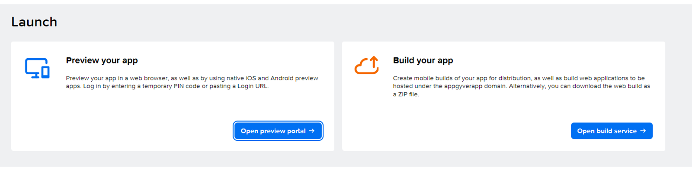

# ♠ 1 [GETTING ACQUAINTED WITH SAP BUILD APPS](https://learning.sap.com/learning-journeys/develop-apps-with-sap-build-apps-using-drag-and-drop-simplicity/getting-acquainted-with-sap-build-apps-_fa9d5799-a3c6-40c0-bb5d-dbfa4eedca18)

> :exclamation: Objectifs
>
> - [ ] Use and organize the SAP Build lobby
>
> - [ ] Use the SAP Build Apps interface

## :closed_book: GETTING ACQUAINTED WITH THE LOBBY

Le **lobby** (SAP Build Lobby) est l'endroit où les trois outils **SAP Build** (**SAP Build Apps**, **SAP Build Process Automation** et **SAP Build Process Work Zone**) se rejoignent le plus étroitement.

Regardez la vidéo pour découvrir comment visualiser les projets **SAP Build** et créer différents types de projets.

[Link Video](https://learning.sap.com/learning-journeys/develop-apps-with-sap-build-apps-using-drag-and-drop-simplicity/getting-acquainted-with-sap-build-apps-_fa9d5799-a3c6-40c0-bb5d-dbfa4eedca18)

### CREATING A NEW PROJECT

Lisez la vidéo pour découvrir comment créer un projet front-end **SAP Build Apps**.

[Link Video](https://learning.sap.com/learning-journeys/develop-apps-with-sap-build-apps-using-drag-and-drop-simplicity/getting-acquainted-with-sap-build-apps-_fa9d5799-a3c6-40c0-bb5d-dbfa4eedca18)

### GETTING ACQUAINTED WITH COMPOSER

Pour vous familiariser avec **Composer**, vous pouvez consulter la section Front-end de l'unité « Utilisation de **SAP Build Apps** », leçon « Visite guidée de **SAP Build Apps** » du parcours d'apprentissage APP110 - Compose and Automate - With SAP Build the No Code Way, mais uniquement la partie front-end.

Lien vers la leçon : https://learning.sap.com/learning-journey/compose-and-automate-with-sap-build-the-no-code-way/taking-a-tour-of-sap-build-apps_cdd0f787-d21b-4c1f-ad70-ffd1bbb3aa00

Pendant que vous travaillez, gardez le projet ouvert sur votre téléphone grâce à l'application **SAP Build Apps Preview**, disponible dans toutes les app stores courantes et téléchargeable gratuitement. Vous pouvez également utiliser le web preview. Pour utiliser le web preview, cliquez simplement sur le bouton « Launch » situé en haut à côté du de l'UI Canvas.

Le paramètre par défaut de le Preview device peut être l'iPhone, mais vous pouvez le modifier pour l'adapter à l'appareil que vous utilisez. Il est conseillé d'utiliser la Preview app pendant la création, afin de visualiser en temps réel les modifications apportées à l'interface utilisateur et aux composants et de les tester. Notez que les modifications doivent être enregistrées dans le projet d'application. Elles seront alors appliquées automatiquement.

## :closed_book: CREATE A PROJECT AND THE FIRST PAGES

### BUSINESS SCENARIO

Dans cet exercice, vous créerez un projet pour l'application Team et les premières pages de préparation avant la création de l'interface utilisateur. Vous apprendrez à ouvrir une preview page pour l'application, utile lors du développement.

Grâce aux exercices de ce Learning Journey, vous créerez une application Team couvrant de nombreuses fonctionnalités de **SAP Build Apps**. Ces dernières pourront être modifiées et transformées en différents scénarios, adaptés aux différents services et domaines. L'application Team comprend une page d'accueil avec un health tracker (outil de suivi de l'état de santé) permettant à l'utilisateur d'enregistrer l'historique sur un on-device storage (périphérique de stockage) et de partager des images et des messages avec ses collègues via une base de données commune. Une deuxième page de partage social illustrera l'utilisation d'une API utilisant OData. Enfin, une page challenge or KPI/balance scorecard présentera d'autres fonctionnalités de **Visual Cloud Functions**.

### EXERCICE OPTIONS

Pour démarrer l'exercice, sélectionnez « Démarrer l'exercice » dans la figure ci-dessous.

Une fenêtre contextuelle s'ouvre. Vous disposez des options suivantes :

Démarrer : la simulation démarre. Suivez la simulation pour apprendre à créer un projet et les premières pages.
Ouvrir le document PDF : un PDF s'ouvre. En suivant les étapes décrites dans ce document, vous pouvez réaliser les exercices dans votre environnement système.

[Link Exercice](https://learnsap.enable-now.cloud.sap/pub/mmcp/index.html?show=project!PR_3DE293A3C85CAFA7:uebung)

[PDF](./RESSOURCES/Exercise%20-%20Unit%201%20-%20Module%203%20-%20001.pdf)
