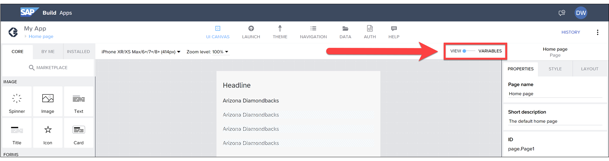
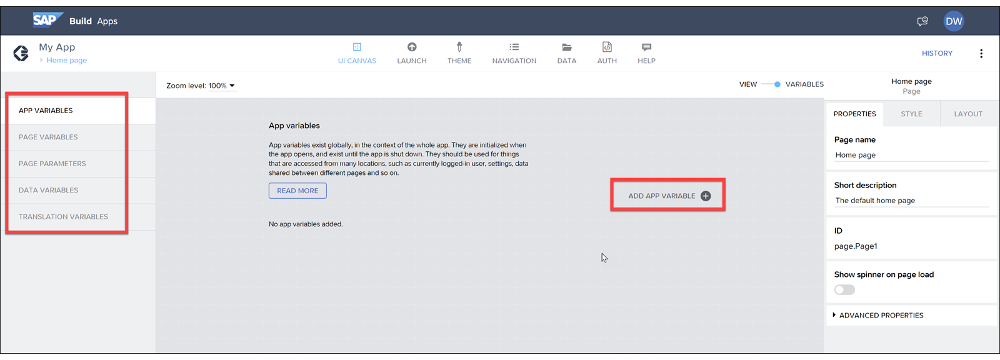

# ♠ 1 [EXPLAINING THE NEED FOR VARIABLES](https://learning.sap.com/learning-journeys/develop-apps-with-sap-build-apps-using-drag-and-drop-simplicity/explaining-the-need-for-variables_b502de2d-7db7-4ee2-8ee1-d282aa7a7c63)

> :exclamation: Objectifs
>
> - [ ] Describe the need for variables.
>
> - [ ] Discuss the key use cases for variables.

## :closed_book: THE NEED FOR VARIABLES

Les variables permettent de stocker des données temporaires dans votre application jusqu'à ce que vous ayez besoin de les afficher, de les lire ou de les envoyer ailleurs, par exemple vers un système back-end.

Par exemple, imaginons une application de calculatrice. Vous devrez stocker les opérandes (les nombres saisis par l'utilisateur pour être additionnés ou multipliés) et le résultat du calcul. Une fois les données stockées dans une variable, vous pouvez afficher la réponse dans un champ texte afin que l'utilisateur puisse voir le résultat.

Vous pouvez utiliser les variables pour stocker :

- Données extraites d'une source de données externe ;

- Informations sur l'utilisateur actuel (comme son nom, son adresse e-mail) ;

- Préférences de l'utilisateur pour l'application pendant son exécution (comme sa page d'accueil préférée, son équipe de baseball préférée) ;

- Informations sur le produit actuellement affiché sur la page.

## :closed_book: KEY USE CASES FOR VARIABLES

### TYPES OF VARIABLES

SAP Build Apps inclut différents types de variables à des fins diverses.

| **TYPE**       | **PURPOSE**                                                                                                                                                                                                                                                                    |
| -------------- | ------------------------------------------------------------------------------------------------------------------------------------------------------------------------------------------------------------------------------------------------------------------------------ |
| App Variable   | Il est utilisé pour stocker les informations qui doivent être accessibles dans toute l'application.                                                                                                                                                                            |
| Page Variable  | Il est utilisé pour stocker les informations qui doivent être accessibles uniquement pour la page en cours.                                                                                                                                                                    |
| Page Parameter | Il sert à stocker les informations nécessaires à l'ouverture de la page actuelle. Par exemple, si vous avez une page de détails de produit affichant des informations sur le produit actuel, la page nécessite un identifiant pour que le produit puisse afficher ses données. |
| Data Variable  | Elle permet de stocker les informations extraites d'une source de données externe. Une variable de données peut être configurée pour stocker un seul enregistrement ou une liste d'enregistrements.                                                                            |

Les paramètres de page et les variables de données ont des cas d'utilisation spécifiques, mais les variables d'application et les variables de page stockent essentiellement des données. Vous vous demandez peut-être quand utiliser l'une ou l'autre.

Vous pourriez stocker toutes vos données dans des variables d'application, mais elles sont toutes affichées ensemble, et vous pourriez en avoir tellement qu'il serait difficile de suivre votre longue liste de variables d'application.

Il serait facile pour vous, et pour toute personne vous aidant à développer votre application, de stocker les données nécessaires pour chaque page dans ces pages, sans les regrouper dans des variables d'application. Ainsi, chaque page pourrait gérer ses propres variables, et vous comprendriez mieux l'utilité de chaque variable.

### DEFINE VARIABLES

L'état par défaut d'une page est « Affichage », qui affiche la disposition de la page avec tous ses composants. Pour définir des variables, définissez l'état sur « Variables ».

Vous trouverez ici un espace pour définir les différents types de variables. Choisissez le type, puis « AJOUTER UNE VARIABLE D'APPLICATION » pour commencer à définir une variable.

