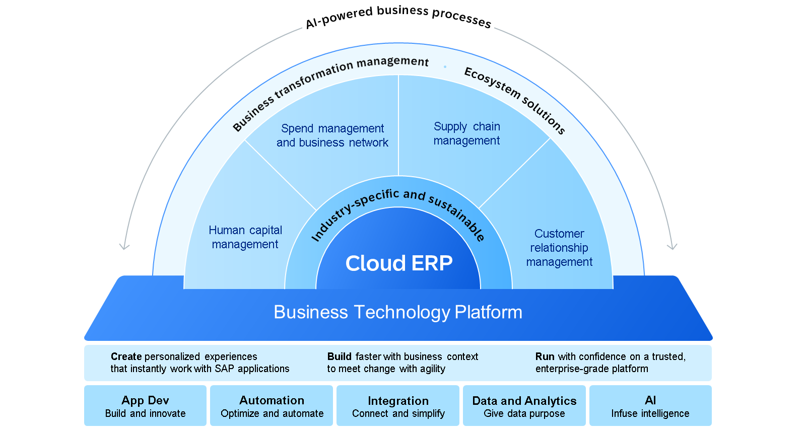
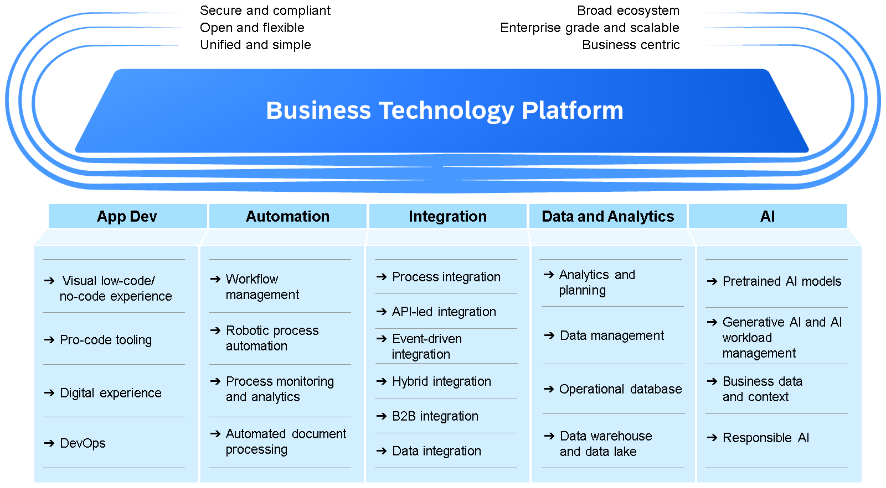

# ♠ 1 [ILLUSTRATING THE SAP BTP](https://learning.sap.com/learning-journeys/discover-sap-business-technology-platform/illustrating-the-intelligent-sustainable-enterprise_df1d2992-a95a-487a-9a06-7226bebbb11d)

> :exclamation: Objectifs
>
> - [ ] Illustrate the SAP Business Technology Platform.

## :closed_book: WHAT IS THE SAP BUSINESS TECHNOLOGY PLATFORM?

Dans ce cours, nous explorons la SAP Business Technology Platform et ses capacités.

La plateforme **SAP Business Technology Platform** est une plateforme versatile (polyvalente) qui permet aux businesses to innovate, integrate, and transform leurs opérations à l'ère du numérique. Grâce à sa gamme d'outils et de services, **SAP BTP** permet aux organisations de surpasser leurs concurrents, de drive business value (générer de la valeur) et d'offrir une provide great customer experiences, le tout via une single platform.

**SAP BTP** propose un ensemble de services fondamentaux incluant le développement d'applications, l'automatisation, l'intégration, les données et l'analyse, ainsi que l'intelligence artificielle. Ces services sont conçus pour fonctionner en parfaite synergie, permettant aux entreprises de créer des applications innovantes, de connecter des systèmes disparates et d'extraire des informations exploitables de leurs données.

La puissance de **SAP BTP** réside dans ses outils permettant de créer des solutions personnalisées. Vous pouvez créer vos propres applications, ou étendre et intégrer des applications et services existants, en fonction de vos besoins métier. Grâce aux solutions low-code ou no-code également proposées par **SAP BTP**, les utilisateurs métier peuvent automatiser des tâches, établir des workflows et concevoir leurs propres interfaces personnalisées.

Une autre caractéristique notable de **SAP BTP** est sa capacité à prendre en charge les solutions cloud natives et hybrides, tout en s'intégrant aux systèmes et sources de données sur site. Cette flexibilité permet aux entreprises de s'adapter à l'évolution des besoins métier et des exigences d'infrastructure sans compromettre la sécurité ni les performances.

L'**Application Development**, **Automation**, **Integration**, **Data and Analytics**, and **AI** sont les piliers fondamentaux de **SAP BTP**, fournissant aux organisations les outils et les capacités dont elles ont besoin pour numériser leurs processus métier, innover rapidement et offrir des expériences client exceptionnelles à l'ère numérique.

#### :small_red_triangle_down: Application Development :

Cet aspect de **SAP BTP** vise à permettre aux développeurs de créer, déployer et gérer efficacement des applications. La plateforme propose divers outils et services de développement prenant en charge différents langages de programmation et approches de développement. Parmi ces outils, **SAP Build Code** est conçu pour créer et étendre des applications métier sur **SAP Business Technology Platform**. **SAP Build Code** offre aux développeurs un environnement collaboratif cloud, doté d'outils et de services préconfigurés pour le développement d'applications, permettant des cycles de développement plus rapides et plus efficaces. De plus, il intègre des fonctionnalités d'**IA** pour accompagner les développeurs. **SAP BTP** prend également en charge le **développement low-code**, permettant aux utilisateurs métier de créer des applications sans connaissances approfondies en codage. Par exemple, dans le cas d'un magasin de vélos, cela pourrait impliquer de créer une application adaptée aux besoins spécifiques de l'entreprise et de fournir aux employés un lien pour un accès facile.

Pour plus d'informations, consultez : https://www.sap.com/products/business-technology-platform/low-code.html

#### :small_red_triangle_down: Automation :

L'automatisation au sein de **SAP BTP** permet aux organisations de rationaliser les tâches répétitives, d'améliorer l'efficacité et de réduire les interventions manuelles dans les processus métier. Cela peut inclure SAP Build Process Automation pour automatiser les tâches routinières telles que la saisie de données ou le traitement des factures. **SAP BTP** offre également des fonctionnalités d'automatisation des workflows, permettant aux organisations de concevoir, d'exécuter et de suivre facilement des workflows métier complexes. En automatisant les tâches et workflows répétitifs, les organisations peuvent libérer des ressources, minimiser les erreurs et se concentrer sur des activités à plus forte valeur ajoutée qui stimulent la croissance de l'entreprise. Si notre magasin de vélos souhaite commander de nouvelles pièces avant qu'elles ne soient en rupture de stock, il pourrait automatiser ce processus. Par exemple, dès que le système détecte que certaines pièces sont en rupture de stock, une commande auprès du fabricant pourrait être déclenchée.

Pour plus d'informations, voir : https://www.sap.com/products/technology-platform/process-automation.html

#### :small_red_triangle_down: Integration :

L'intégration est un aspect essentiel de **SAP BTP**, car elle permet une communication et un échange de données fluides entre différents systèmes, applications et sources de données. **SAP BTP** propose la suite SAP Integration pour faciliter la connectivité entre les environnements sur site et cloud, ainsi qu'avec les partenaires et clients externes. Des ressources pour la gestion des API et du contenu métier pré-conçu pour des solutions prêtes à l'emploi sont également disponibles. Grâce à l'intégration sur **SAP BTP**, les entreprises peuvent décloisonner les données, rationaliser les processus métier et exploiter tout le potentiel de leur écosystème numérique. Si notre magasin de vélos doit se connecter au système du fabricant, il peut vérifier les API existantes dans le SAP Business Accelerator Hub ou en créer avec la suite SAP Integration.

Pour plus d'informations, consultez : https://www.sap.com/products/integration.html

#### :small_red_triangle_down: Data and Analytics :

Les fonctionnalités de données et d'analyse de **SAP BTP** permettent aux organisations d'exploiter leurs données de manière approfondie, de prendre des décisions éclairées et d'optimiser leurs résultats. Cela inclut des services d'entreposage de données, de modélisation de données et d'analyse avancée. **SAP BTP** offre également des fonctionnalités de visualisation de données et des services de machine learning pour permettre aux organisations de découvrir des schémas, des tendances et des opportunités cachés dans leurs données. En exploitant la puissance des données et de l'analyse de **SAP BTP**, les organisations peuvent acquérir un avantage concurrentiel, optimiser leurs opérations et innover en toute confiance. Avec ses fournisseurs, ses clients et son équipe commerciale, notre magasin de vélos accumule de nombreuses données précieuses. Ces données peuvent être stockées, gérées et visualisées grâce aux produits de gestion de données **SAP BTP** tels que SAP Analytics Cloud, SAP Datasphere, SAP HANA Cloud, etc.

Pour plus d'informations, consultez : https://www.sap.com/products/analytics.html

#### :small_red_triangle_down: Artificial Intelligence (AI) :

**SAP BTP** propose un ensemble complet de technologies et de services d'**IA**, notamment SAP AI Business Services et Generative AI Hub. Ces solutions permettent aux entreprises d'exploiter la puissance de l'intelligence artificielle pour stimuler l'innovation, améliorer l'efficacité et apporter de la valeur ajoutée à leurs clients. En exploitant ces capacités d'**IA**, les entreprises peuvent garder une longueur d'avance sur la concurrence et prospérer dans l'économie numérique actuelle. Les clients de notre magasin de vélos fictif peuvent bénéficier de recommandations personnalisées basées sur l'**IA** pour trouver le produit qui leur convient le mieux et bénéficier d'une expérience client enrichie.

Pour plus d'informations, consultez : https://www.sap.com/products/artificial-intelligence.html
