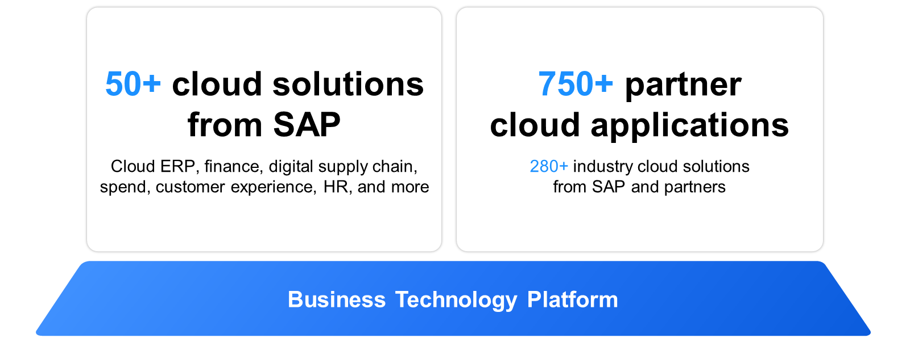
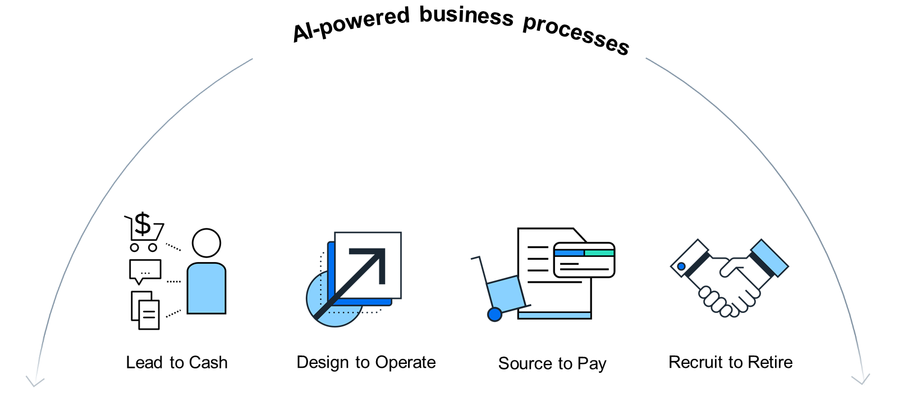

# ♠ 1 [IDENTIFUING SOLUTIONS AREAS OF SAP & BUSINESS PROCESSES](https://learning.sap.com/learning-journeys/discover-sap-business-technology-platform/identifying-solution-areas-of-the-intelligent-sustainable-enterprise_c46fd60f-ece0-4d3e-9496-1a4b0ec355f9)

> :exclamation: Objectifs
>
> - [ ] Identify Solution Areas of SAP and SAP Partners.
>
> - [ ] Illustrate Business Processes.

## :closed_book: SAP SOLUTIONS PROTFOLIO

Les solutions SAP couvrent les domaines de la gestion des ressources d'entreprise, de la gestion des dépenses, de la gestion du capital humain, de la gestion de la relation client, et bien plus encore. L'ensemble de la solution SAP repose sur l'ERP cloud SAP S/4HANA Cloud, entouré d'autres solutions SAP, voire d'applications tierces. Parmi ces solutions, on trouve :

- `SAP Ariba`

- `SAP SuccessFactors`

- `SAP Concur`

- `SAP Customer Experience`

- Et bien plus encore...

#### :small_red_triangle_down: SAP SuccessFactors: HXM Suite :

La gestion de l'expérience humaine (HXM) représente une évolution de la gestion du capital humain (HCM), mettant l'accent sur l'amélioration de l'expérience des employés plutôt que sur la simple gestion des processus RH transactionnels. SAP SuccessFactors HCM intègre les atouts de la gestion traditionnelle du capital humain avec des fonctionnalités supplémentaires conçues pour fournir des informations exploitables. SAP SuccessFactors est un logiciel RH cloud qui englobe les fonctions RH clés, la paie et l'analyse des ressources humaines, ainsi que quatre domaines clés de la gestion des talents : le recrutement, la formation et le développement, la rémunération et la gestion de la performance.

Pour plus d'informations, consultez https://www.sap.com/products/human-resources-hcm.html.

#### :small_red_triangle_down: SAP SuccessFactors: SAP Ariba :

Les entreprises peuvent réaliser leur transformation numérique en collaborant avec leurs fournisseurs et partenaires commerciaux sur SAP Business Network. SAP Ariba propose des solutions cloud pour une collaboration efficace.

Ces solutions couvrent l'ensemble du processus d'achat, permettant de contrôler les dépenses, d'identifier de nouvelles opportunités d'économies et de maintenir une chaîne d'approvisionnement saine. L'automatisation, les connexions réseau et les analyses basées sur les données renforcent les partenariats. Grâce aux solutions de gestion des dépenses de SAP Ariba et à SAP Business Network, les entreprises peuvent gérer toutes leurs dépenses sur une plateforme cloud unique et intégrée.

Pour plus d'informations, consultez https://www.ariba.com/.

#### :small_red_triangle_down: SAP SuccessFactors: SAP Concur :

Dans le cadre de la gestion des dépenses, SAP Concur propose aux entreprises des solutions cloud pour la gestion des notes de frais, des déplacements et des factures. Concur Expense s'intègre aux systèmes financiers tels que les ERP, les CRM, les RH et la comptabilité, centralisant ainsi les données de dépenses.

Concur Expense simplifie les remboursements grâce à des rapports automatisés. Concur Travel rationalise les réservations, garantissant le respect des politiques et la supervision administrative des voyages. Concur Invoice automatise la comptabilité fournisseurs, améliorant ainsi la gestion de la trésorerie et la visibilité des dépenses.

Pour plus d'informations, consultez https://www.concur.com/.

#### :small_red_triangle_down: SAP SuccessFactors: SAP Customer Experience :

SAP Customer Experience est une offre intégrée conçue pour moderniser l'approche commerciale traditionnelle des solutions CRM existantes. Elle prend en charge diverses fonctions front-office, telles que la protection des données clients, le marketing, le commerce, les ventes et le service client.

L'objectif est de placer le client au cœur des opérations commerciales. Grâce à une technologie interconnectée, SAP Customer Experience facilite la gestion des relations clients tout au long de leur cycle de vie. L'objectif est d'améliorer la satisfaction, d'automatiser les campagnes, de résoudre efficacement les problèmes et de rationaliser les processus.

Pour plus d'informations, consultez https://www.sap.com/products/crm.html.

> Note
>
> Outre les solutions SAP, de nombreuses applications sectorielles sont disponibles. Ces solutions aident les entreprises de secteurs tels que le pétrole et le gaz, l'automobile et la santé à répondre à leurs besoins spécifiques et à améliorer l'efficacité de leurs opérations. Nombre de ces applications, développées par SAP et ses partenaires, sont basées sur SAP Business Technology Platform ou intégrées à celle-ci.

Chacune de ces solutions, ainsi que de nombreuses autres de SAP, de partenaires et de fournisseurs tiers, peut être intégrée à la plateforme SAP Business Technology pour créer des processus métier complets de bout en bout. Cette intégration aide les organisations à rationaliser leurs opérations entre leurs différents services, garantissant un flux de données cohérent et une meilleure prise de décision. Ainsi, les entreprises peuvent accroître leur efficacité opérationnelle et bénéficier d'une vision globale de leurs processus.

## :closed_book: BUSINESS PROCESSES

Les entreprises intelligentes, soutenues par des fonctionnalités d'IA, doivent exceller dans tous leurs processus commerciaux critiques de bout en bout qui couvrent plusieurs applications et technologies telles que :

#### :small_red_triangle_down: Lead to Cash :

CRM et expérience client – ​​Gérer tous les aspects de l'expérience client est complexe, car les données clients et commandes sont réparties sur plusieurs systèmes de traitement des commandes et de prestation de services. Le processus Lead to Cash couvre l'ensemble de la chaîne de processus métier, du premier contact avec un client potentiel à l'exécution de la commande et à la prestation de services.

#### :small_red_triangle_down: Design to Operate :

Chaîne d'approvisionnement numérique - Un manque de visibilité sur la chaîne d'approvisionnement augmente les risques et les coûts pour votre entreprise. Les problèmes de chaîne d'approvisionnement et de logistique peuvent impacter chaque phase de votre activité et nuire à l'expérience client. Le processus « Conception-Exploitation » représente l'ensemble du cycle de vie des produits dans une chaîne d'approvisionnement de bout en bout, connectée et interopérable, depuis la conception, la planification, la fabrication et la livraison d'un produit jusqu'à son fonctionnement et sa maintenance.

#### :small_red_triangle_down: Source to Pay :

Gestion du réseau et des dépenses – Assurer la conformité de tous les systèmes impliqués dans les achats opérationnels est un défi, car toutes les informations sur les dépenses sont réparties sur de nombreux systèmes différents. Une analyse et une gouvernance intelligentes des dépenses ne sont possibles qu'avec une visibilité en temps réel sur toutes les catégories d'achats. Le processus « Source to Pay » commence par la recherche, la négociation et la contractualisation avec le fournisseur de biens, et se termine par le paiement final de ces biens.

#### :small_red_triangle_down: Recruit to Retire :

RH et engagement des collaborateurs – Comprendre et gérer tous les aspects de vos effectifs est de plus en plus complexe dans notre monde décentralisé et numérique. Vos processus métier doivent évoluer au rythme de vos collaborateurs pour garantir leur productivité, leur engagement et leur épanouissement. Le processus « Recruter pour la retraite » se concentre sur le cycle de vie de l'employé au sein de l'organisation. Il commence par la planification des effectifs, se poursuit par l'embauche et l'intégration, la gestion des effectifs (données sur les employés et l'emploi), la saisie des temps, la paie, et se termine par le départ à la retraite.

## :closed_book: KEY TAKEWAYS OF THIS LESSON

Les domaines de solutions constituent un autre élément clé de la stratégie de SAP. Avec SAP S/4HANA comme solution ERP cloud centrale et les solutions du portefeuille cloud sectoriel, les clients bénéficient d'un large éventail de fonctionnalités. Les processus de bout en bout (du lead au cash, de la conception à l'exploitation, de l'approvisionnement au paiement et de l'embauche au retrait) sont des composantes essentielles des opérations commerciales modernes.
