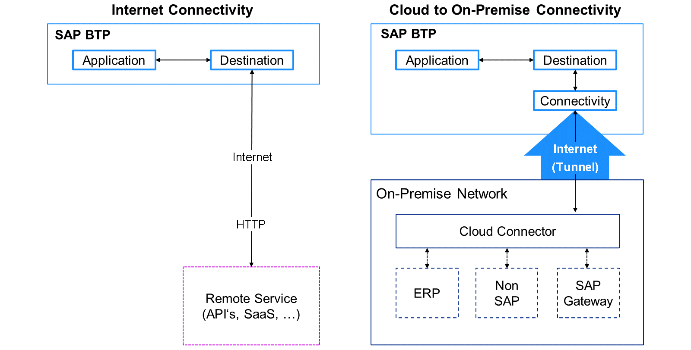

# ♠ 1 [ANALYZING CONNECTIVITY IN SAP BTP](https://learning.sap.com/learning-journeys/discover-sap-business-technology-platform/analyzing-connectivity-in-sap-btp_e525e7d8-20a0-41f7-8b79-eec4aad834a8)

> :exclamation: Objectifs
>
> - [ ] Able to analyze the connectivity in SAP BTP.

## :closed_book: CONNECTIVITY IN SAP BTP

### WHY DO YOU NEED CONNECTIVITY IN SAP BTP?

En tant qu'entreprise intelligente et durable, vous suivez la stratégie du « noyau propre ». Vous souhaitez créer des extensions ou des projets de développement personnalisés côte à côte, tout en les intégrant à des fonctionnalités ou des données provenant d'Internet ou de votre environnement système sur site. Vous devez les connecter entre eux. Pour cela, SAP BTP offre des fonctionnalités de connectivité.

### CONNECTIVITY SERVICES

Le service SAP Connectivity fournit un proxy de connectivité permettant d'accéder aux ressources sur site via un connecteur cloud. Grâce au service SAP Destination, vous pouvez récupérer et stocker les informations techniques sur la ressource cible (destination) nécessaires à la connexion de votre application à un service ou système distant (connecteur Internet ou cloud).

### WHAT IS THS CLOUD CONNECTOR?

Le connecteur Cloud connecte les back-ends SAP sur site (ou même les systèmes non SAP pris en charge) aux sous-comptes SAP BTP via un tunnel chiffré. La connexion est bidirectionnelle. D'un point de vue architectural, le connecteur Cloud constitue un point de défaillance unique potentiel. À cet effet, il offre également des possibilités de haute disponibilité, de surveillance, d'alertes, etc. Vous devez configurer le connecteur Cloud dans votre environnement et le connecter à vos sous-comptes SAP BTP. Ensuite, vous devez définir les ressources système partagées. L'accès aux ressources partagées via le connecteur Cloud se fait via les destinations consommatrices.

Le connecteur Cloud allie une installation simple à une configuration claire des systèmes exposés à SAP BTP, vous permettant d'utiliser les ressources sur site existantes sans exposer l'ensemble de l'environnement interne et d'agir comme un proxy d'invocation inverse entre le réseau sur site et SAP BTP.

### CONNECTIVITY TYPES

En principe, il existe deux types de connexions vers et depuis SAP BTP :

- Internet Connectivity.

- Cloud to On-Premise Connectivity (or other way around).

La ​​connectivité Internet est nécessaire pour exploiter les fonctionnalités ou les données d'une ressource sur Internet, tandis que la connectivité Cloud vers site est utilisée pour exploiter les ressources de votre environnement local. La connectivité Internet est accessible via HTTPS, tandis que la connexion à un système local nécessite le connecteur Cloud. La communication est bidirectionnelle.

> Note
>
> Veuillez noter que ce contenu concerne la connectivité SAP BTP en général et l'environnement SAP BTP Cloud Foundry. La connectivité avec l'environnement SAP BTP Kyma et l'environnement SAP BTP ABAP diffère. Pour plus d'informations, consultez la documentation d'exploitation de ces environnements.
>
> - [Documentation d'exploitation de l'environnement SAP BTP Kyma](https://help.sap.com/docs/btp/sap-business-technology-platform/administration-and-operations-in-kyma-environment)
>
> - [Documentation d'exploitation de l'environnement SAP BTP ABAP](https://help.sap.com/docs/btp/sap-business-technology-platform/administration-and-operations-in-abap-environment)

### READ MORE

[Read more about SAP BTP Connectivity in general](https://help.sap.com/viewer/cca91383641e40ffbe03bdc78f00f681/Cloud/en-US/e54cc8fbbb571014beb5caaf6aa31280.html).

## :closed_book: KEY TAKEWAYS OF THIS LESSON

SAP BTP offre des fonctionnalités de connectivité permettant de connecter le cloud à des logiciels sur site. Vous pouvez même utiliser des destinations pour connecter des solutions cloud à des services externes. La connectivité Internet est assurée via HTTPS, tandis que la connexion à un système sur site nécessite le Cloud Connector. L'avantage de ce dernier est qu'il crée une connexion sécurisée permettant aux produits SAP d'interagir avec SAP BTP via un tunnel chiffré.
