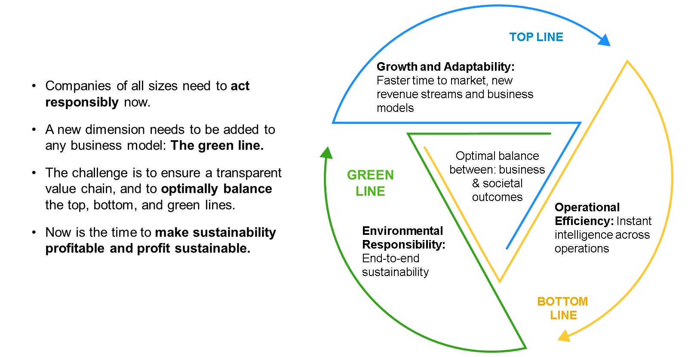
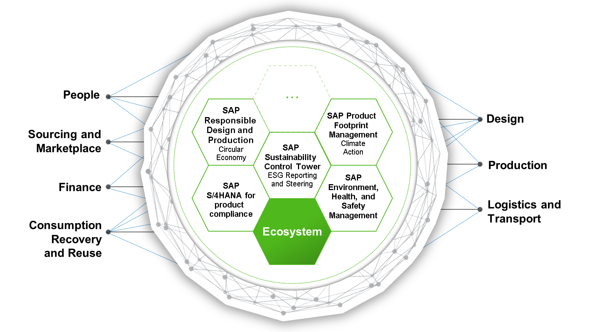

# ♠ 1 [ILLUSTRATING THE NEED FOR SUSTAINABLE ENTERPRISES](https://learning.sap.com/learning-journeys/discover-sap-business-technology-platform/illustrating-the-need-for-sustainable-enterprises_e927829f-1009-48c9-b37a-06a2819e5885)

> :exclamation: Objectifs
>
> - [ ] Value the green line.
>
> - [ ] Analyze the three zero strategy.
>
> - [ ] Identify the sustainability solutions from SAP Cloud for Sustainable Enterprises.

## :closed_book: BUSINESS INTRODUCTION: THE NEED FOR SUSTAINABLE ENTERPRISES

[Link Video](https://learning.sap.com/learning-journeys/discover-sap-business-technology-platform/illustrating-the-need-for-sustainable-enterprises_e927829f-1009-48c9-b37a-06a2819e5885)

Votre organisation souhaite devenir plus durable. Plusieurs pistes s'offrent à vous pour atteindre cet objectif important : réduire l'empreinte carbone de vos produits, limiter les déchets et mener des initiatives de responsabilité sociale. Enfin, vous pourriez rendre compte de ces mesures de manière globale aux autorités de régulation, aux investisseurs et à vos clients.

## :closed_book: THE GREEN LINE OF AN ENTERPRISE

### POSITION OF SUSTAINABILITY IN THE INTELLIGENT, SUSTAINABLE ENTERPRISE

Dans notre monde moderne, le développement durable est plus important que jamais. Les investisseurs souhaitent connaître votre exposition aux risques liés au changement climatique. Les régulateurs souhaitent que vous décarboniez vos activités. Les employés veulent connaître votre position sur les questions sociales. Les clients souhaitent des produits à empreinte carbone minimale, issus de sources éthiques et produits sans déchets. SAP propose des solutions et une stratégie pour vous aider à atteindre vos objectifs de développement durable grâce à ses logiciels.

Transformer une entreprise déjà rentable en une entreprise rentable et, de surcroît, durable représente un défi de taille. En particulier, de nombreuses entreprises utilisent les logiciels SAP, et la plupart des transactions mondiales passent par ces systèmes. SAP reconnaît son rôle et sa responsabilité de contribuer à la création d'un avenir durable aux côtés de ses clients grâce à ses solutions et technologies numériques. Cela permettra de gérer les ressources limitées des entreprises et, par conséquent, de la planète de la manière la plus productive et la plus durable possible.

L'objectif de SAP est de répondre à vos besoins en matière de développement durable grâce à de nouvelles solutions logicielles et à l'intégration de fonctionnalités de développement durable dans ses produits existants.

Vous pouvez lire un article de [Thomas Saueressig qui explique le plan gagnant de SAP en matière de durabilité ici](https://news.sap.com/2021/09/building-solutions-future-arrived/).

### THE GREEN LINE OF AN ENTERPRISE

Le développement durable ne se limite pas à la neutralité carbone, il s'agit aussi de valoriser nos ressources et d'une cohabitation respectueuse et éthique au sein de notre civilisation. Les clients de SAP peuvent compter sur un nombre croissant de produits pour les accompagner vers une démarche plus durable, par exemple en matière de protection du climat, la réduction des émissions de gaz à effet de serre étant un objectif majeur de notre stratégie. Cela va de pair avec le recyclage des équipements. De nombreux secteurs industriels insistent également sur l'extension des responsabilités des fabricants. SAP fournit également à ses clients toute l'assistance nécessaire pour optimiser leurs savoir-faire et leurs ressources.

De nombreuses entreprises doivent gérer la responsabilité environnementale (ligne verte) sans experts dédiés en développement durable, avec des ressources informatiques minimales et sans perdre leur dynamisme. D'où la nécessité d'une solution systémique.

Par conséquent, tous les intérêts commerciaux, tels que l'efficacité et la croissance, doivent être alignés et équilibrés de manière optimale avec les intérêts durables comme la responsabilité environnementale. Il est également important de comprendre que la ligne verte est également considérée comme un facteur d'entrée essentiel dont l'impact s'accroît au fil du temps. Ce n'est qu'une fois ce principe pleinement accepté que les bonnes décisions globales pourront être prises pour assurer la durabilité de l'entreprise.

### THE THREE ZERO STRATEGY

Si vous souhaitez minimiser l'empreinte carbone de vos produits et opérations tout au long de votre chaîne de valeur, vous pouvez utiliser les fonctionnalités d'analyse et de transaction intégrées aux applications d'entreprise SAP. Les produits SAP offrent de nombreuses fonctionnalités, et nous proposons également des solutions pour accompagner votre entreprise tout au long de son parcours. Par exemple, SAP propose les solutions suivantes :

#### :small_red_triangle_down: SAP Product Footprint Management :

Évaluez les performances de vos produits par rapport à une grande variété de catégories d’empreinte environnementale.

#### :small_red_triangle_down: SAP Environment, Health, and Safety Management :

Identifiez, analysez, réagissez et récupérez des risques environnementaux, sanitaires et de sécurité avant qu'ils n'affectent vos employés et vos clients.

#### :small_red_triangle_down: SAP E-Mobility :

Favorisez une mobilité durable et pratique en permettant des scénarios tels que les opérations de points de recharge à distance, la gestion de flottes électriques et la gestion des actifs de points de recharge sur une seule plateforme cloud.

#### :small_red_triangle_down: TripIt by SAP Concur :

Consultez les émissions carbone de vos vols. Suivez vos émissions annuelles de vol.

### CIRCULAR ECONOMY - CHASING ZERO WASTE

Optimisez la valeur de votre entreprise en renforçant sa résilience à long terme grâce à la réduction des déchets, en créant des opportunités commerciales et économiques et en améliorant l'environnement et la vie des citoyens. Vous pouvez utiliser de nombreuses fonctionnalités déjà intégrées à nos produits ou utiliser des solutions autonomes, telles que :

#### :small_red_triangle_down: SAP Responsible Design and Production :

Cette solution aidera les entreprises à suivre les engagements publics et les nouvelles réglementations.

#### :small_red_triangle_down: SAP Rural Sourcing Management :

Donnez à votre entreprise agroalimentaire les moyens de recycler davantage en connectant les petits exploitants agricoles à votre chaîne d’approvisionnement agricole.

#### :small_red_triangle_down: SAP SAP S/4HANA Cloud for product compliance :

Protégez vos revenus et la réputation de votre marque en innovant et en proposant des produits qui offrent plus de valeur qu'ils n'en prennent.

#### :small_red_triangle_down: SAP Intelligent Returns Management :

SAP IntDrive propose des options de retour respectueuses de l'environnement et réduit la quantité de déchets qui finissent dans les décharges. Gestion intelligente des retours

### SOCIAL RESPONSIBILITY - CHASING ZERO INEQUALITY

Intégrez des pratiques éthiques et respectueuses de l'environnement à un modèle compétitif et performant grâce aux solutions SAP suivantes :

#### :small_red_triangle_down: SAP Business Integrity Screening :

Atténuez les risques de fraude et garantissez la continuité des activités en identifiant rapidement les activités anormales.

#### :small_red_triangle_down: SAP Qualtrics Employee Technology Experience :

Accélérez l'impact de la diversité, de l'équité et de l'inclusion en obtenant des informations en temps réel.

#### :small_red_triangle_down: SAP SuccessFactors Human Experience Management Suite :

Obtenez des informations sur la conformité et l'éthique grâce à l'analyse et au reporting agrégés des données RH.

### SAP CLOUD FOR SUSTAINABLE ENTERPRISES

Pour garantir une démarche durable, votre entreprise doit poser les bases d'une entreprise intelligente et durable. Les composants sous-jacents, que vous devriez déjà connaître grâce aux chapitres précédents, sont : SAP S/4HANA Cloud, SAP Business Technology Platform, SAP Analytics Cloud, et bien d'autres.

SAP Cloud for Sustainable Enterprises propose des solutions logicielles intégrées et interconnectées, enrichies de fonctionnalités spécifiques aux problématiques de développement durable. Il offre des fonctionnalités permettant d'être plus responsable dans l'utilisation des ressources ou de gérer les émissions de carbone des produits et des entreprises.

Il est évident qu'en matière de développement durable, aucune entreprise ne peut résoudre seule les grands problèmes. Les entreprises doivent travailler en groupe pour s'attaquer aux problèmes ; autrement dit, créer un réseau d'entreprises intelligentes et durables, connectées et intégrées.

Pour y parvenir, SAP Cloud for Sustainable Enterprise propose des solutions telles que :

#### :small_red_triangle_down: SAP Sustainability Control Tower :

Pilotez les performances en matière de développement durable en créant des modèles commerciaux qui alignent la rentabilité sur la durabilité.

#### :small_red_triangle_down: SAP Environment, Health, and Safety Management :

Travaillez en toute sécurité en identifiant, analysant et atténuant les risques de manière proactive. Avec l'application SAP EHS Management, vous pouvez rester en conformité et réduire votre impact environnemental.

[Plus d'informations](https://www.sap.com/products/scm/ehs-management-health-safety.html).

Découvrez [SAP Environment, Health, and Safety Management grâce à notre parcours de formation](https://learning.sap.com/learning-journey/discover-the-environment-health-safety-modules-in-sap-s-4hana).

#### :small_red_triangle_down: SAP S/4HANA for product compliance :

Assurez la conformité à chaque étape du cycle de vie de vos produits grâce à notre logiciel de conformité produit. Avec SAP S/4HANA pour la conformité produit, vous pouvez gérer les exigences réglementaires et de développement durable, suivre les enregistrements et les volumes de substances, classer les produits et créer des documents de conformité, ainsi qu'emballer, transporter et stocker correctement les matières dangereuses grâce à un étiquetage précis.

En savoir plus sur [SAP S/4HANA pour la conformité produit](https://www.sap.com/products/scm/product-compliance.html).

> Pour avoir une bonne vue d'ensemble de vos objectifs financiers et de développement durable, vous devez disposer d'un pilotage et d'un reporting holistiques et transparents.

Au-delà des mesures financières, évaluez les conséquences des actions de l'entreprise sur la société, l'environnement et l'économie au sens large, en ajoutant une dimension verte et sociale à votre reporting financier. Vous devez étendre la transparence aux paramètres financiers, opérationnels, de conformité, environnementaux et sociaux.

## :closed_book: KEY TAKEWAYS OF THIS LESSON

SAP vous offre tout le nécessaire pour développer vos propres applications en exploitant l'intelligence artificielle. SAP AI Core vous permet d'entraîner et de déployer vos propres modèles d'IA, et grâce à SAP AI Launchpad, vous pouvez facilement administrer et superviser tous vos cas d'utilisation d'IA. Votre entreprise réalise ainsi des économies grâce à la mise en œuvre de vos modèles basés sur l'IA, un gain de temps et une garantie de conformité et de gouvernance.
