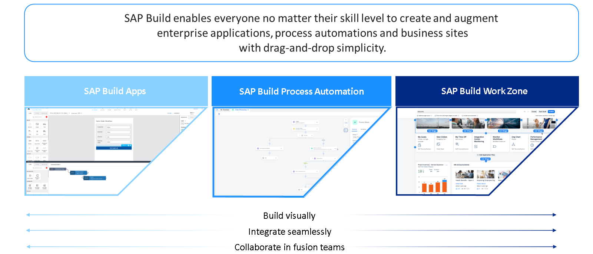

# ♠ 1 [EXAMINING BUSINESS MODELS](https://learning.sap.com/learning-journeys/experiencing-end-to-end-sap-build/exploring-sap-build-end-to-end-scenarios)

> :exclamation: Objectifs
>
> - [ ] Explain SAP Build foundations.
>
> - [ ] Discover SAP Build use cases.

## :closed_book: THE VALUE SAP BUILD PRODUCT COMBINATION

Vous pouvez maintenant consulter les détails du point de terminaison concerné. Cette vue est particulièrement importante car elle fournit également des informations sur les rôles ou les portées requis pour exécuter l'API, ainsi que sur les paramètres requis lors de l'appel de l'API. Dans l'exercice suivant, vous découvrirez les étapes exactes requises pour utiliser une API SAP Build Process Automation.

Un concept particulièrement intéressant est le développement en équipe fusionnée, qui intègre différentes solutions et rôles SAP Build, permettant ainsi de rassembler l'ensemble des éléments au sein d'un projet cohérent. Cette approche innovante favorise la collaboration et simplifie le processus de développement, permettant aux équipes de travailler plus efficacement.

Cet exemple de parcours d'apprentissage montre comment l'intégration transparente des solutions low-code SAP Build, notamment SAP Build Process Automation, SAP Build Apps et SAP Build Work Zone, permet de développer rapidement un scénario de bout en bout grâce à la fonctionnalité glisser-déposer. Cela accélère non seulement le processus de développement, mais minimise également le besoin de codage intensif, le rendant ainsi accessible à un plus large éventail d'utilisateurs.

## :closed_book: EXPLORING END-TO-END USE CASES

[Link Video](https://learning.sap.com/learning-journeys/experiencing-end-to-end-sap-build/exploring-sap-build-end-to-end-scenarios)

De nombreux cas d'utilisation illustrent comment les produits SAP Build peuvent être intégrés pour relever divers défis métier. Pour une meilleure compréhension, quelques exemples sont présentés ci-dessous, illustrant l'utilisation de SAP Build Process Automation, SAP Build Apps et SAP Build Work Zone dans des scénarios de bout en bout. Ces exemples seront présentés dans un premier temps pour donner un aperçu avant que les méthodes ne soient approfondies plus tard dans le cours.

#### :small_red_triangle_down: Automated Invoice Processing :

La combinaison de différents services de la plateforme SAP Business Technology Platform (BTP) ouvre d'autres possibilités. Par exemple, SAP Build Apps permet de créer rapidement une application capable de capturer des factures grâce à une logique d'appareil prédéfinie. SAP Build Process Automation peut ensuite analyser ces documents à la recherche des informations souhaitées grâce à un service d'intelligence artificielle et les intégrer à un processus d'automatisation. Parallèlement, les applications, processus ou informations peuvent être affichés sur un site métier préalablement créé avec SAP Build Work Zone.

#### :small_red_triangle_down: Supporting Employee Relocation :

SAP Build peut également être utile pour accompagner les employés lors de leur relocalisation grâce à ses fonctionnalités RH. Grâce à SAP Build Process Automation, un processus de relocalisation unifié et centralisé peut être mis en place. Des tâches telles que l'attribution des rôles et la création des plannings de réunions s'exécutent automatiquement en impliquant les parties prenantes concernées (employés, partenaires RH, responsables d'accueil). Avec SAP Build Apps, les employés reçoivent des applications personnalisées pour effectuer leurs tâches, tandis que les partenaires RH peuvent ajouter des données ou définir les exigences nécessaires. Les employés peuvent trouver des informations précieuses sur le processus de relocalisation et leur futur espace de travail sur une page métier centralisée (créée avec SAP Build Work Zone), qui sert également d'espace de travail RH pour les partenaires RH. Grâce à l'interaction des fonctionnalités de SAP Build, il est plus facile de fournir des conseils clairs tout au long du processus de relocalisation.

#### :small_red_triangle_down: Automated Bid Management :

Un autre cas pratique où SAP Build peut s'avérer utile est la création d'espaces de travail et de processus spécialisés pour la gestion des appels d'offres. SAP Build Process Automation automatise le processus d'appel d'offres de bout en bout, du téléchargement d'un appel d'offres à son approbation. Dans le cadre de ce processus automatisé, SAP Build Apps peut facilement soumettre l'appel d'offres, vérifier si les exigences sont remplies et identifier les employés à impliquer. Cela permet d'élaborer un plan global qui peut être soumis pour approbation. SAP Build Work Zone est l'espace de travail central où l'équipe d'appel d'offres peut échanger des connaissances, partager des articles intéressants ou discuter de sujets spécifiques. Dans cet exemple, SAP Build contribue à la collaboration interéquipes et optimise la gestion des réponses grâce à un espace de travail spécialisé.

#### :small_red_triangle_down: Sales Order Management :

SAP Build peut rationaliser le processus de gestion des commandes clients en automatisant les workflows de bout en bout. Grâce à SAP Build Process Automation, des déclencheurs, des formulaires et des workflows sont créés pour collecter des données, puis intégrés de manière fluide à SAP S/4HANA pour la création des commandes clients. Une application simple développée avec SAP Build Apps répertorie les produits et initie les commandes dans SAP S/4HANA. De plus, un site d'entreprise utilisant SAP Build Work Zone peut inclure un forum et un flux pour le processus de commande clients, intégrant l'application pour un accès simplifié. L'intégration d'UI5 Cards à BAS améliore la visualisation et l'interaction des données, offrant ainsi un système de gestion des commandes clients efficace et collaboratif.

### ADDITIONAL USE CASES AND END-TO-END EXERCISES

- [Exercice pratique](https://trials.cfapps.eu10-004.hana.ondemand.com/) pour le processus de commande client décrit ci-dessus, réalisable dans le même système que l'exercice final. La dernière leçon contient les instructions pour les identifiants.

- [Tutoriel complet](https://developers.sap.com/group.sap-build-use-case-buddy.html) pour la création d'un partenaire de cas d'utilisation.

- [Aperçu des autres cas d'utilisation SAP](https://www.sap.com/products/technology-platform/use-cases.html?sort=latest_desc) en général.

Deux cas d'utilisation supplémentaires sont abordés dans ce cours : le premier (réapprovisionnement en entrepôt) guide les leçons et le contenu avec des exemples, et le second (inscription à la certification) constitue l'exercice final de la dernière leçon.

## :closed_book: INTRODUCING THE LEARNING JOURNEY USE CASE

### SAP BUILD PRODUCTS

Ce parcours d'apprentissage a un double objectif. Premièrement, il constitue une ressource complémentaire pour illustrer les exigences et les opportunités liées à l'intégration des produits SAP Build dans un environnement low-code. Deuxièmement, il prépare les apprenants à la certification low-code, démontrant leur compréhension des fonctionnalités des produits low-code SAP Build ainsi que des avantages et fonctionnalités de leur intégration. Les fonctionnalités clés de chaque produit SAP Build, également nécessaires à la réalisation de l'exercice final, sont abordées dans leurs parcours d'apprentissage principaux respectifs :

Pour SAP Build Process Automation : [Création de processus et d'automatisations avec SAP Build Process Automation](https://learning.sap.com/learning-journeys/create-processes-and-automations-with-sap-build-process-automation)

Pour SAP Build Apps :

- [Développer des applications avec SAP Build Apps grâce à la simplicité du glisser-déposer](https://learning.sap.com/learning-journeys/develop-apps-with-sap-build-apps-using-drag-and-drop-simplicity)

- [Extension de SAP S/4HANA avec SAP Build Apps et l'extensibilité utilisateur clé](https://learning.sap.com/learning-journeys/extending-sap-s-4hana-with-sap-build-apps-and-key-user-extensibility)

Pour SAP Build Work Zone :

- [Développer des applications avec SAP Build Apps grâce à la simplicité du glisser-déposer](https://learning.sap.com/learning-journeys/develop-apps-with-sap-build-apps-using-drag-and-drop-simplicity)

- [Concevoir SAP Build Work Zone](https://learning.sap.com/learning-journeys/designing-sap-build-work-zone)

> Note
>
> Throughout the various lessons and the final exercise, essential methods are revisited or referenced to enhance understanding.

### INTEGRATION OF THE SAP BUILD SERVICES

L'objectif de ce parcours d'apprentissage est de créer un processus simplifié de bout en bout, reliant rapidement les trois solutions low-code de SAP Build mentionnées, afin d'acquérir une compréhension initiale de l'intégration et des méthodes associées.

L'exercice final consiste à créer un processus qui démarre par un déclencheur d'API et aboutit à une approbation automatique ou manuelle basée sur une condition simple. Ce processus est déclenché par une application, créée à partir d'une page unique contenant les composants nécessaires et une logique simple. Enfin, l'application sera déployée et implémentée sous forme de carte dans la zone de travail SAP Build.

> Note
>
> Une description plus détaillée peut être trouvée à la fin du parcours d'apprentissage.

### NEXT STEPS

Grâce aux parcours d'apprentissage et aux conseils de répétition mentionnés ci-dessus, l'application, le processus et le site métier peuvent être créés. Pour acquérir les connaissances nécessaires à l'intégration de SAP Build Apps, SAP Build Process Automation et SAP Build Work Zone, nous nous concentrerons sur la deuxième unité.

À l'aide de ce cours et des parcours d'apprentissage mentionnés ci-dessus, vous pourrez construire les trois parties de la deuxième unité, reliant ainsi le portefeuille SAP Build LCNC.

Pour une meilleure compréhension des concepts, ce parcours s'appuiera sur le cas d'utilisation du magasin S.MART. S.MART a développé un processus supplémentaire pour optimiser les niveaux de stock en automatisant les réapprovisionnements lorsque certains critères sont remplis. Ce processus et l'application correspondante sont intégrés à SAP Build Work Zone pour créer un tableau de bord centralisé, offrant des informations en temps réel et une gestion des stocks simplifiée.

Plus d'informations et des parcours de valeur détaillés sur ce cas d'utilisation sont disponibles [ici](https://six-event-companion-app.cfapps.eu10.hana.ondemand.com/btp-experience).

Mais avant cela, nous expliquerons dans la leçon suivante le rôle de SAP Business Technology Platform dans ce scénario d'intégration.
