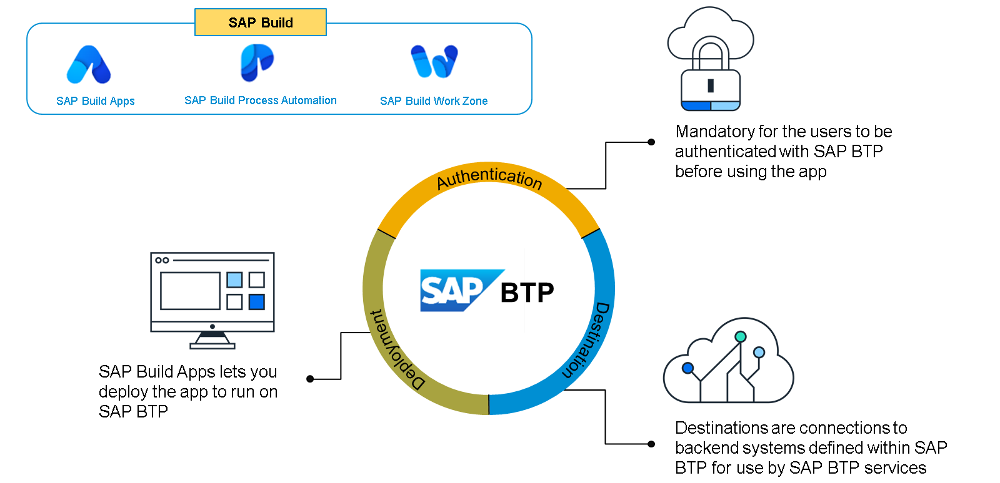
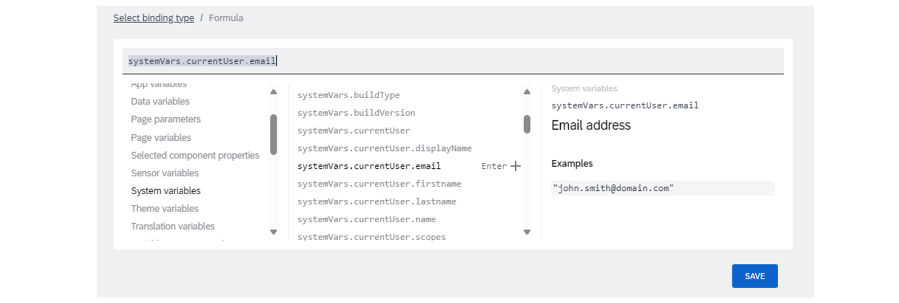
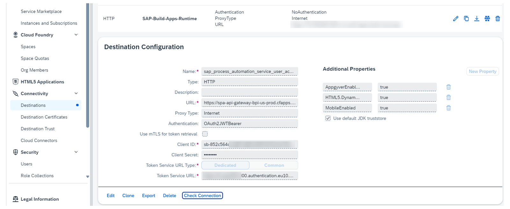

# ♠ 2 [IDENTIFYING THE RELATIONSHIP BETWEEN SAP BUILD AND SAP BTP](https://learning.sap.com/learning-journeys/experiencing-end-to-end-sap-build/identifying-the-relationship-between-sap-build-and-sap-btp)

> :exclamation: Objectifs
>
> - [ ] Identify the Connection between SAP Build and SAP BTP.

## :closed_book: SAP BTP AND SAP BUILD

Outre les principales fonctionnalités de création d'applications, de nombreuses fonctionnalités facilitent la création d'extensions SAP et d'autres applications liées à SAP :

#### :small_red_triangle_down: Destinations :

Les destinations sont des connexions aux systèmes back-end, souvent SAP, définies dans SAP BTP pour être utilisées par les services SAP BTP. SAP Build prend en compte les destinations définies dans le cockpit SAP BTP et peut créer des ressources de données (c'est-à-dire des connexions aux systèmes back-end) basées sur ces destinations. SAP Systems décrit comment configurer des destinations pour SAP Build Apps.

#### :small_red_triangle_down: Deployment to SAP BTP :

SAP Build Apps vous permet de déployer votre application pour qu'elle s'exécute sur SAP BTP. SAP Build Apps vous permet de créer votre projet dans un fichier MTAR, un fichier d'application compris par l'environnement Cloud Foundry de SAP BTP, puis d'envoyer le fichier pour déploiement dans SAP BTP.

#### :small_red_triangle_down: SAP BTP Authentication :

Vous pouvez rendre obligatoire l'authentification des utilisateurs auprès de SAP BTP avant d'utiliser l'application. Cette authentification est requise pour de nombreuses autres fonctionnalités, comme le référencement des destinations SAP BTP.

### MORE ADVANCED FEATURES

SAP Build Apps propose également des fonctionnalités plus sophistiquées permettant aux utilisateurs métier et aux développeurs plus expérimentés d'exploiter pleinement la plateforme. L'intégration de SAP Build Apps à SAP Business Technology Platform (BTP) offre plusieurs fonctionnalités pratiques. L'un des principaux avantages est la possibilité d'utiliser l'éditeur de formules pour incorporer dynamiquement des variables récupérant des informations de SAP BTP, telles que le nom ou l'adresse e-mail de l'utilisateur authentifié. Par exemple, l'adresse e-mail est accessible via une variable spécifique dans l'éditeur de formules.

Cette variable, appelée `userEmail`, peut ensuite être intégrée dynamiquement dans SAP Build Apps. Cette fonctionnalité améliore l'utilité pour les utilisateurs finaux et optimise les processus de bout en bout. Grâce à cette fonctionnalité, l'adresse e-mail d'un utilisateur authentifié via SAP BTP Authentication peut servir de base à divers processus ou paramètres lorsque ces derniers sont déclenchés. Cette intégration souligne l'intérêt de l'authentification pour améliorer la personnalisation et optimiser l'automatisation des workflows, garantissant ainsi une utilisation sécurisée et efficace des données utilisateur au sein des applications.

### DESTINATIONS

Dans SAP Business Technology Platform (BTP), les destinations sont des points de terminaison prédéfinis qui facilitent la communication sécurisée entre vos applications et les systèmes externes, qu'ils soient sur site ou dans le cloud. Elles stockent des informations de connexion essentielles, telles que les URL et les informations d'authentification, garantissant ainsi la sécurité des échanges de données.

Dans le cadre des produits SAP Build, des destinations correctement configurées sont essentielles à une intégration et une communication fluides entre divers services tels que SAP Build Process Automation, SAP Build Work Zone, SAP Build Apps et SAP S/4HANA Cloud. Ces configurations garantissent le bon déclenchement des processus et le transfert cohérent des données, favorisant ainsi la cohérence des workflows.

La destination SAP BTP sap_process_automation_service_user_access assure une communication sécurisée et efficace entre les différents services SAP, facilitant ainsi les nouveaux flux de processus entre SAP Build Apps et SAP Build Process Automation pour un déclenchement fluide des processus. Le mécanisme OAuth2JWTBearer utilise des jetons Web JSON (JWT) pour l'accès autorisé, garantissant ainsi que seuls les utilisateurs légitimes peuvent interagir avec les services. Des mesures de sécurité supplémentaires, telles que mTLS (Mutual Transport Layer Security), vérifient les deux partenaires de communication, tandis que la protection CSRF empêche les commandes non autorisées.

La prise en charge des applications mobiles et HTML5 offre un accès flexible à SAP Build Process Automation et aux autres produits SAP Build, permettant aux utilisateurs d'intégrer ces services à leurs workflows existants, où qu'ils soient. Les informations d'identification pertinentes, telles que l'ID client, le secret client et l'URL du service de jetons, sont disponibles dans le cockpit SAP BTP. L'ID client identifie de manière unique le client OAuth, le secret client est une clé confidentielle nécessaire à l'authentification, et l'URL du service de jetons sert à générer et récupérer les jetons d'authentification. Cette configuration permet l'automatisation et la rationalisation des processus au sein de SAP Build Apps et SAP Build Process Automation, garantissant une utilisation sécurisée et ininterrompue des services SAP.

### FURTHER READING

- [Further information about the Connectivity Service](https://learning.sap.com/learning-journeys/discover-sap-business-technology-platform/analyzing-connectivity-in-sap-btp_e525e7d8-20a0-41f7-8b79-eec4aad834a8)

- [Further information about Destinations](https://learning.sap.com/learning-journeys/administrating-sap-business-technology-platform/using-destinations)
