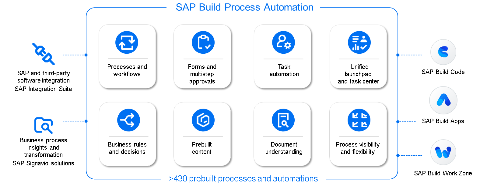
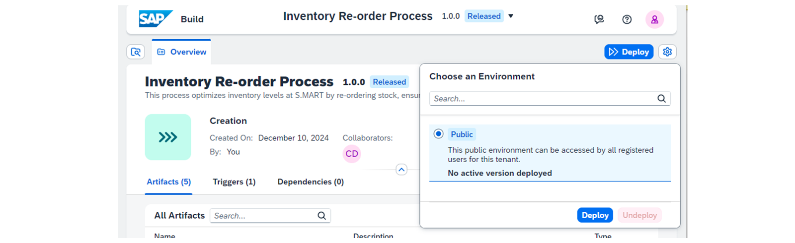
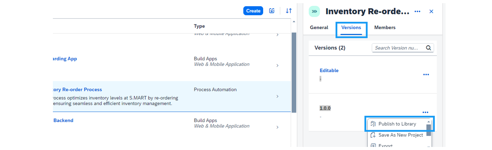

# ♠ 1 [EXPLORING SAP BUILD PROCESS AUTOMATION FOR SEAMLESS INTEGRATION](https://learning.sap.com/learning-journeys/experiencing-end-to-end-sap-build/sap-build-process-automation)

> :exclamation: Objectifs
>
> - [ ] Repeat SAP Build Process Automation Foundation.
>
> - [ ] Enhance business process efficiency by using SAP Build Process Automation.
>
> - [ ] Ensure seamless process release, deployment, and publishing with SAP Build Process Automation.

## :closed_book: SAP BUILD AUTOMATION IN A NUTSHELL

SAP Build Process Automation permet aux organisations d'automatiser leurs workflows et processus grâce à des outils visuels intuitifs. Les développeurs peuvent concevoir, modifier et améliorer leurs processus métier en minimisant leur dépendance aux ressources informatiques. La plateforme propose des outils conviviaux, tels que le générateur de processus et le générateur de formulaires, avec une fonctionnalité de glisser-déposer simple pour optimiser l'automatisation. Les utilisateurs peuvent ainsi innover et optimiser efficacement leurs workflows.

De plus, la plateforme prend en charge des fonctionnalités avancées de gestion des workflows, telles que les règles métier, la visibilité des processus, la flexibilité et l'intégration de l'IA. Les utilisateurs peuvent également étendre l'automatisation grâce à des fonctionnalités intégrées d'automatisation robotisée des processus (RPA) et tirer parti d'artefacts réutilisables, tels que des robots et des composants de workflow. SAP Build Process Automation combine les fonctionnalités de workflow et d'automatisation au sein d'une solution unique et transparente.

Pour en savoir plus sur SAP Build Process Automation, consultez notre parcours de formation : [Créer des processus et des automatisations avec SAP Build Process Automation](https://learning.sap.com/learning-journey/create-processes-and-automations-with-sap-build-process-automation)

### SAP BUILD PROCESS AUTOMATION BUSINESS SCENARIO

Le magasin S.MART a développé un processus d'optimisation des stocks. Ce processus garantit le déclenchement des commandes en entrepôt lorsque certains critères sont remplis. Ce nouveau processus est disponible dans la bibliothèque SAP Build et peut donc être déclenché ultérieurement par les applications SAP Build. Cela facilite l'intégration et l'automatisation transparentes de la gestion des stocks.

## :closed_book: TRIGGERING PROCESSES WITH API INTEGRATION

Un Trigger d'API est un mécanisme qui démarre un processus lorsqu'un système externe lui envoie un appel d'API. Dans ce cas d'utilisation, nous devons utiliser un Trigger d'API, car le processus doit être initié par une application, en transmettant des entrées spécifiques dans le cadre de la requête d'API.

Un Trigger d'API permet d'automatiser les processus, d'assurer l'intégration en temps réel de différents systèmes et de configurer de manière flexible des flux de travail personnalisés. Cela améliore l'efficacité, la cohérence des données et la convivialité de l'expérience utilisateur. De plus, un Trigger d'API contribue à l'évolutivité et à la pérennité de l'infrastructure technologique en facilitant l'intégration de nouveaux systèmes et applications.

### OVERVIEW OF TRIGGER TYPES

| **Trigger Type**  | **Explanation**                                                     |
| ----------------- | ------------------------------------------------------------------- |
| API Trigger       | Initiates a process through an API call from an external system.    |
| Form Trigger      | Starts a process when a user submits a form.                        |
| Event Trigger     | Launches a process based on a defined event in the system.          |
| Scheduled Trigger | Executes processes or automations at a predefined time or interval. |

### SUMMARY

Un Trigger d'API est idéal pour les scénarios où des processus doivent être initiés par des systèmes externes. En suivant les étapes ci-dessus, vous pouvez configurer un Trigger d'API pour assurer une communication fluide entre les applications et les processus.

## :closed_book: TO CONFIGURE A PROCESS TO TRIGGER AN API REQUEST WITH SPECIFIC INPUTS

Configurez un processus pour déclencher une requête API avec des entrées spécifiques.

### STEPS

1. Create the Trigger:

   - Open the Trigger tile in the process editor and select Add Trigger.

   - Choose the API Trigger option.

2. Name the Trigger:

   - Provide a name and description for the trigger.

   - The identifier is automatically generated based on the name.

3. Configure Process Inputs:

   - Open the Process Panel to display Process Details.

   - Navigate to Variables → Process Inputs → Configure.

4. Add Inputs:

Choose Add Input and enter the following details:

     - Name: Specify the input name.

     - Identifier: Automatically generated or manually adjusted.

     - Type: Choose either String or Boolean.

     - Required: Mark whether this input is mandatory.

5. Save the configuration to activate the API trigger.

## :closed_book: DEPLOY AND PUBLISH PROCESSES TO THE SAP BUILD LIBRARY

Avant de pouvoir utiliser le scénario d'intégration pour connecter un processus, une application et un espace de travail dans SAP Build, il est essentiel de s'assurer que les processus nécessaires sont correctement déployés et publiés dans la bibliothèque SAP Build. Cette préparation garantit que tous les composants sont prêts pour une intégration transparente.

Pour commencer, accédez à votre projet dans SAP Build Process Automation. Vérifiez que vous utilisez la bonne version en sélectionnant « Afficher la version du projet ». Cette étape est essentielle car elle garantit le déploiement de la dernière version de votre projet.

Accédez ensuite à la section « Déployer » de l'interface. Sélectionnez l'environnement dans lequel vous souhaitez déployer votre processus. Il peut s'agir d'un environnement de développement, de test ou de production, selon vos besoins. Lancez le processus de déploiement en cliquant sur « Déployer ». À cette étape, vous serez informé de la création d'un déclencheur. Ce déclencheur est essentiel au bon déroulement du processus. Confirmez le déploiement en cliquant à nouveau sur « Déployer ». Vous recevrez des mises à jour sur son état au fur et à mesure de sa progression. Une fois le déploiement terminé, un message de confirmation s'affichera, indiquant que votre processus est correctement déployé et actif.

Une fois le processus déployé, l'étape suivante consiste à le publier dans la bibliothèque SAP Build, afin de le rendre accessible pour une utilisation et une intégration ultérieures.

1. Retournez dans le lobby et localisez votre projet spécifique, par exemple « Processus de réapprovisionnement S.MART ».

2. Accédez à la section « Versions ». Vous y trouverez différentes versions de votre projet.

3. Cliquez sur les trois points à côté de la version que vous souhaitez publier et sélectionnez « Publier dans la bibliothèque ».

Cette action garantit que votre processus est non seulement déployé, mais également accessible dans la bibliothèque, permettant ainsi aux autres utilisateurs de l'utiliser selon leurs besoins.

En suivant ces étapes, vous vous assurez que votre processus est entièrement préparé et disponible pour l'intégration. Cette préparation est cruciale car elle garantit que tous les processus back-end sont en place et fonctionnels, ouvrant la voie à une intégration fluide avec l'application et les composants de l'espace de travail dans SAP Build Apps.

Une fois votre processus correctement déployé et publié, vous pouvez commencer la création et l'intégration de votre application en toute confiance, sachant que tous les composants nécessaires sont prêts et disponibles.
