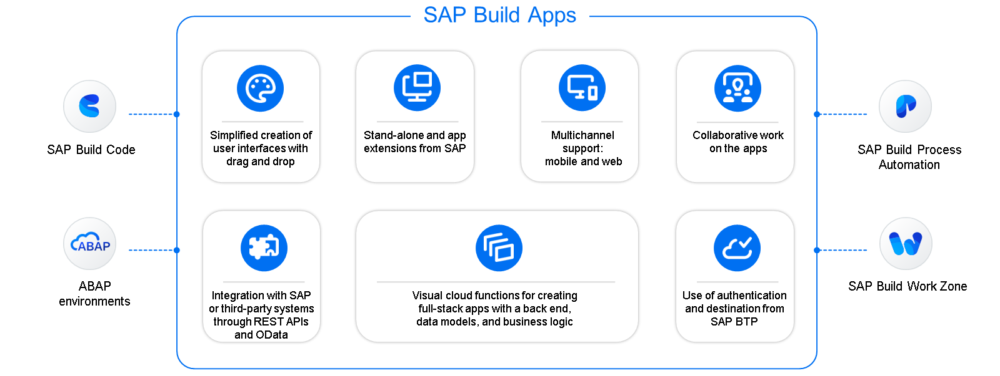
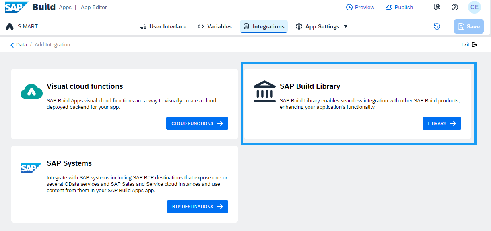
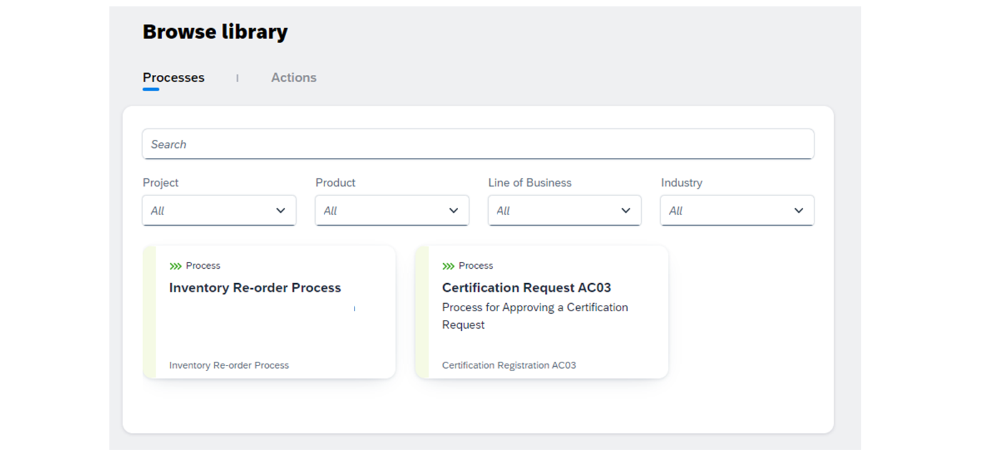
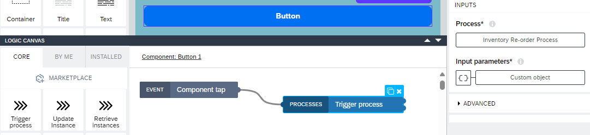
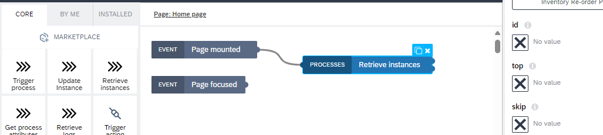
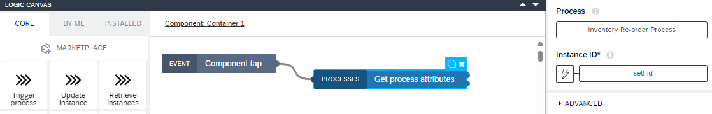
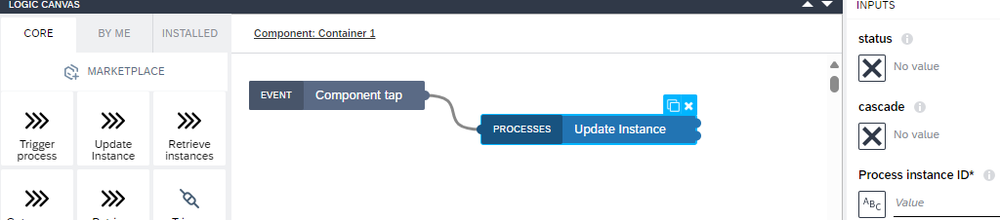

# ♠ 2 [DISCOVERING SAP BUILD APPS FOR SEAMLESS INTEGRATION](https://learning.sap.com/learning-journeys/experiencing-end-to-end-sap-build/sap-build-apps)

> :exclamation: Objectifs
>
> - [ ] Repeat SAP Build Apps Foundation.
>
> - [ ] Integrate processes from the SAP Build Library.
>
> - [ ] Discover SAP Build Apps process logic.

## :closed_book: SAP BUILD APPS IN A NUTSHELL

SAP Build Apps offre une expérience de développement unique et une innovation rapide grâce à une méthode simple pour créer des applications personnalisées, que vous pouvez ajouter à vos solutions SAP. Grâce à la fonctionnalité glisser-déposer, il est possible de créer des interfaces utilisateur avec une bibliothèque de composants constamment mise à jour, sans aucune expérience de développement. De plus, il est possible de créer n'importe quelle logique grâce aux fonctions de flux visuel, et d'utiliser des propriétés de style individuelles et une prise en charge avancée des thèmes. Ainsi, vos applications créées fonctionnent sur le web, iOS, Android et en environnement d'exécution natif optimisé pour chaque plateforme.

L'accès à vos données et autres données à l'interface utilisateur est simplifié grâce aux API OData et REST. De plus, le traitement efficace des données est assuré par des formules et plus de 500 fonctions prédéfinies, prises en charge par une fonction de recherche et des exemples de cas d'utilisation. Cela vous permet, par exemple, d'effectuer des calculs, de mettre en forme du texte, d'affecter des objets et des listes, ou de créer des styles dynamiques.

### SAP BUOLD APPS BUSINESS SCENARIO

Afin d'optimiser la gestion des stocks, S.MART a développé une application qui s'intègre à SAP Build Process Automation. Les responsables de magasin S.MART l'utilisent pour lancer des réapprovisionnements dès que les niveaux de stock descendent en dessous d'un seuil spécifié. L'application permet de déclencher le processus de réapprovisionnement depuis la bibliothèque SAP Build. En ajoutant une fonction de déclenchement de flux de processus et en liant les paramètres d'entrée nécessaires aux champs variables correspondants, le processus est lancé de manière fluide depuis l'application et le workflow est exécuté automatiquement. Cela garantit le bon déroulement et l'efficacité des réapprovisionnements chez S.MART.

## :closed_book: SAP BUILD LIBRARY

Dans la leçon précédente, nous avons montré comment publier les processus de SAP Build Process Automation dans la bibliothèque SAP Build, les rendant ainsi facilement détectables et utilisables dans d'autres produits SAP Build. Pour intégrer ces processus aux applications SAP Build, vous devez d'abord activer l'intégration.

Si aucun processus n'a été intégré auparavant, le bouton « AJOUTER UNE INTÉGRATION » se trouve au milieu de l'écran. Outre les vignettes Visual Cloud Functions pour le backend de SAP Build Apps et la vignette SAP Systems pour l'intégration avec d'autres systèmes utilisant les services OData et les destinations SAP BTP, une vignette SAP Build Library est désormais disponible. Cette nouvelle vignette facilite l'intégration transparente entre les produits SAP Build, permettant de retrouver et d'utiliser facilement les processus précédemment créés et publiés depuis SAP Build Process Automation, sans recourir aux logiques de données traditionnelles pour utiliser les API.

> Note
>
> Avant l'introduction de SAP Build Library, l'échange de données dans SAP Build Process Automation s'effectuait à l'aide de fonctions de flux et de l'éditeur de formules. SAP Build Library simplifie ce processus, rendant la collaboration dans Fusion Teams plus efficace et plus rapide.

### PROCEDURE TO INTEGRATE A PROCESS

1. Sélectionnez le bouton BIBLIOTHÈQUE de la mosaïque SAP Build Library.

2. Dans la vue Parcourir la bibliothèque, sélectionnez le processus précédemment publié dans le lobby SAP Build dans la liste ci-dessous.

3. Sur la page d'aperçu contenant des informations détaillées sur les actions du processus, sélectionnez « Activer le processus ».

> Note
>
> Vous pouvez également désactiver le processus ici. Ceci est particulièrement nécessaire si vous souhaitez supprimer un processus de la bibliothèque SAP Build.

4. Sélectionnez « Quitter » ou « Données » pour revenir à l'aperçu de l'intégration.

Dans la vue Intégration, le processus est répertorié dans la nouvelle section « Bibliothèque SAP Build ». Par exemple, vous pouvez utiliser ce processus directement dans le canevas logique par simple glisser-déposer pour déclencher différents processus. Ces processus peuvent être ceux que vous avez créés personnellement ou ceux développés par d'autres membres de votre équipe projet dans l'environnement SAP Build Process Automation. De plus, toutes les mises à jour du processus seront affichées dans cette section, accompagnées d'informations détaillées pour vous tenir informé des dernières modifications.

## :closed_book: PROCESS FLOW FUNCTIONS

#### :small_red_triangle_down: Trigger processes :

Dans la plupart des environnements d'entreprise numériques, des processus efficaces et automatisés sont essentiels. SAP Build Process Automation offre une solution fiable pour la conception et la gestion de processus de bout en bout. Une utilisation efficace de SAP Build consiste à déclencher des processus directement depuis SAP Build Apps grâce à des composants logiques intégrés. Avant de commencer, il est important de suivre les étapes nécessaires, telles que la configuration de la destination du service d'automatisation des processus afin de faciliter la communication et la transmission des messages, et de s'assurer que le processus est déployé et publié dans la bibliothèque SAP Build.

Exemple : S.MART détecte les ruptures de stock et optimise ses processus de réapprovisionnement grâce à SAP Build Apps. Le responsable du magasin utilise SAP Build App pour déclencher un réapprovisionnement lorsque le niveau de stock d'un produit est bas. Il saisit les détails de la commande (numéro d'article, quantité souhaitée) dans l'application et déclenche le processus de réapprovisionnement à l'aide d'un bouton. Cela intègre la logique de processus nécessaire au système et lance le workflow, garantissant un réapprovisionnement fluide et efficace.

Suivez les étapes suivantes pour implémenter la logique de déclenchement :

1. Activez le processus pour votre application dans la bibliothèque SAP Build.

2. Faites glisser le composant de logique de déclenchement dans le canevas logique et liez-le à l'événement correspondant (par exemple, un clic) du bouton.

3. Liez les paramètres d'entrée nécessaires aux champs de variables correspondants.

Par exemple, dans un scénario de gestion des commandes, le responsable du magasin pourrait saisir les détails de la commande dans l'application et déclencher le processus en cliquant sur un bouton. L'application traiterait alors la saisie et lancerait automatiquement le workflow, garantissant une expérience fluide et efficace. L'onglet « Suivi » du lobby SAP Build vous permet de visualiser les nouvelles instances de processus et leurs détails. SAP Build aide ainsi S.MART à rationaliser ses opérations grâce à une automatisation transparente des processus.

#### :small_red_triangle_down: Retrieve instances :

Outre le déclenchement de processus, vous pouvez également récupérer toutes les instances d'un processus spécifique directement depuis SAP Build Apps grâce au composant logique intégré. Pour ce faire, utilisez la fonction de récupération d'instances depuis la nouvelle zone de processus des fonctions de flux. Assurez-vous de sélectionner le processus précédemment activé dans l'onglet Intégration. Différents filtres permettent d'affiner les instances en fonction de paramètres tels que l'heure de début, le statut et l'ID d'instance.

Exemple : Les responsables de magasin chez S.MART surveillent toutes les instances du processus de réapprovisionnement afin de vérifier le statut et la progression des commandes. Ils utilisent SAP Build App pour récupérer la liste de toutes les instances de commande en cours et appliquer des filtres pour trier les commandes par statut (par exemple, « en cours », « expédiée »). Cela leur permet de réagir rapidement aux problèmes potentiels et de préserver la chaîne d'approvisionnement.

Pour mettre en œuvre cette fonctionnalité :

1. Ajoutez une fonction de flux de récupération d'instances au canevas logique de votre application et liez-la à un événement, comme le montage d'une page.

2. Configurez les filtres nécessaires, tels que le statut ou l'heure de début des instances.

3. Liez les instances récupérées à une variable de page (par exemple, pour réorganiser les instances).

Le mappage dynamique des champs de sortie aux éléments d'interface utilisateur correspondants permet une représentation visuelle claire. Par exemple, utilisez un composant d'élément de liste d'icônes dont l'icône peut changer en fonction du statut de chaque instance.

SAP Build aide ainsi S.MART à rationaliser les opérations métier en simplifiant la gestion et le suivi des instances de processus.

#### :small_red_triangle_down: Get Process Attributes :

Il est crucial non seulement de déclencher et de récupérer des processus, mais aussi d'accéder à leurs attributs spécifiques. SAP Build vous permet d'afficher dynamiquement des informations détaillées sur une instance de processus en récupérant ses attributs.

Exemple : Les responsables de magasin chez S.MART ont besoin d'informations détaillées sur des instances de commande spécifiques pour préparer les stocks entrants. Grâce à l'application SAP Build, ils peuvent sélectionner une commande spécifique pour afficher des attributs tels que la date de commande, la description du produit et les informations sur le fournisseur. Pour ce faire, la fonction de récupération des attributs de processus est intégrée à l'interface utilisateur. Ces informations détaillées contribuent à une préparation et une gestion efficaces de la réception des marchandises.

Dans l'interface utilisateur, vous pouvez également afficher les attributs de l'instance de processus. Lorsqu'un utilisateur sélectionne une instance, un conteneur masqué s'affiche, affichant ses attributs. Pour ce faire, il suffit de récupérer les attributs du processus et de les lier à une variable qui les affiche.

Pour implémenter cette fonction :

1. Ajoutez une fonction de récupération des attributs de processus au canevas logique de votre application.

2. Liez cette fonction à un événement, tel qu'un clic sur une instance de commande.

3. Configurez la sortie pour mettre à jour automatiquement les éléments d'interface utilisateur pertinents affichant les attributs du processus.

SAP Build accompagne S.MART dans cette démarche en fournissant des informations détaillées et accessibles, nécessaires à une gestion et une préparation efficaces des stocks.

#### :small_red_triangle_down: Update Instances :

Enfin, il est important de pouvoir mettre à jour les propriétés des instances de processus individuelles. SAP Build vous permet de modifier des attributs tels que le statut d'une instance de processus donnée (en la définissant sur ANNULÉ ou EN COURS D'EXÉCUTION) ou de mettre à jour d'autres détails comme les données utilisateur ou les numéros de commande. Par exemple, un responsable de magasin peut avoir besoin de mettre à jour les coordonnées d'un client ou de corriger un numéro de commande. SAP Build facilite ces mises à jour en modifiant des attributs de processus spécifiques.

Exemple : Un responsable de magasin chez S.MART met à jour le statut d'une commande erronée en « annulée ». Cette opération peut être effectuée directement via l'application SAP Build en modifiant le statut de l'instance de commande concernée. En spécifiant des paramètres d'entrée tels que l'ID de l'instance de processus et le nouveau statut, ces modifications sont automatiquement communiquées à tous les services concernés afin d'éviter toute action inutile et d'améliorer l'efficacité.

> Note
>
> Due to asynchronous processing, these status changes might not take effect immediately. If any errors occur, the error outputs offer detailed information to help diagnose the issue.

Les principaux paramètres d'entrée incluent le nouveau statut de l'instance de processus et l'ID de l'instance à modifier. Vous pouvez également spécifier si le changement de statut doit se répercuter sur l'instance spécifiée et toutes ses instances de sous-flux, ou uniquement sur l'instance concernée.

L'intégration de ces composants logiques dans vos applications SAP Build permet à S.MART de gérer les instances de processus avec flexibilité et d'ajuster leur statut en fonction des besoins métier.
