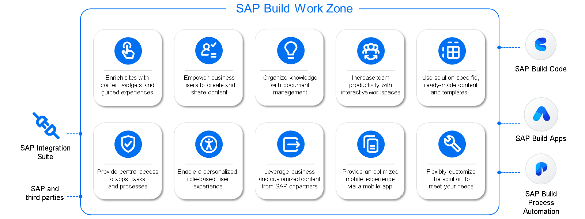

# ♠ 3 [EXPLORING SAP BUILD WORK ZONE FOR SEAMLESS INTEGRATION](https://learning.sap.com/learning-journeys/experiencing-end-to-end-sap-build/sap-build-work-zone)

> :exclamation: Objectifs
>
> - [ ] Repeat SAP Build Work Zone Foundation.
>
> - [ ] Implement End-To-End Projects.

## :closed_book: SAP BUILD WORK ZONE IN A NUTSHELL

SAP Build Work Zone centralise l'accès aux applications, processus, informations et communications métier pertinents au sein d'un point d'entrée unifié, accessible depuis n'importe quel appareil. Vous pouvez l'utiliser pour créer facilement et rapidement des solutions d'espace de travail numérique par glisser-déposer afin d'améliorer la productivité et l'engagement des utilisateurs, tout en offrant l'expérience de travail unifiée, intelligente et personnalisée souhaitée.

Vous pouvez intégrer des applications et services SAP sur site et dans le cloud, des applications tierces telles que SharePoint Online pour Microsoft 365 et Microsoft Teams, et bien sûr vos propres applications et processus personnalisés créés avec SAP Build Apps ou SAP Build Process Automation. Administrateurs et utilisateurs bénéficient d'un large éventail d'options pour partager et trouver rapidement toutes les informations et collaborer, par exemple via des blogs, des supports multimédias, des enquêtes, des sondages, des pages wiki, des événements, des articles de la base de connaissances, des tâches et des flux.

Pour en savoir plus sur SAP Build Work Zone, consultez notre parcours de formation : [Implémentation et administration de SAP Build Work Zone](https://learning.sap.com/learning-journey/implement-and-administer-sap-build-work-zone)

### SAP BUILD WORK ZONE BUSINESS SCENARIO

S.MART utilise SAP Build Work Zone pour créer des tableaux de bord centraux offrant un aperçu en temps réel des processus de gestion des stocks et de réapprovisionnement. Ces tableaux de bord affichent les indicateurs clés et l'état des réapprovisionnements en cours, déclenchés par SAP Build Apps et traités automatiquement par SAP Build Process Automation. En intégrant des cartes et en implémentant l'application dans la Work Zone, les utilisateurs accèdent à toutes les informations et fonctionnalités pertinentes depuis un emplacement centralisé. Cela améliore la transparence et facilite la prise de décision en matière de gestion des stocks.

## :closed_book: SAP BUILD WORK ZONE WORKSPACES

### OVERVIEW OD WORKSPACES AND WORKPAGES

SAP Build Work Zone offre des environnements flexibles pour la collaboration et l'organisation. Les espaces de travail sont conçus pour intégrer outils, applications et contenus, répondant à divers cas d'usage. Qu'il s'agisse de partager des informations à grande échelle, de gérer des projets sensibles ou de créer des tableaux de bord personnels, les espaces de travail améliorent la productivité et rationalisent les flux de travail.

Types of Workspaces

Public Workspaces: Ouverts à un large public, y compris aux utilisateurs externes, les espaces de travail publics sont idéaux pour partager des informations à l'échelle de l'entreprise, comme les documents RH en libre-service ou les centres de support informatique. Ils proposent des modes de lecture seule optionnels et sont accessibles via la recherche globale, améliorant ainsi l'accessibilité.

Private Workspaces: Conçus pour un accès restreint, les espaces de travail privés nécessitent une invitation ou une attribution de rôle pour y accéder. Ils sont adaptés aux projets sensibles tels que les campagnes marketing ou les initiatives informatiques, garantissant la confidentialité tout en favorisant une collaboration ciblée.

My Workspace: Tableau de bord personnel pour chaque utilisateur, « Mon Espace de Travail » sert de plateforme centralisée pour gérer les tâches, les applications et le contenu adapté à ses activités quotidiennes. Cet espace de travail est privé et inaccessible, offrant un environnement efficace pour l'organisation et la productivité personnelles.

### INTRODUCTION TO WORKPAGES

Les pages de travail sont des pages dynamiques et personnalisables au sein des espaces de travail, qui hébergent du contenu interactif, notamment des widgets, des applications et des cartes d'interface utilisateur. Conçues pour la flexibilité, elles peuvent être structurées selon des grilles pour répondre à divers besoins. L'éditeur de pages intuitif permet aux administrateurs de créer et de modifier des pages de travail par simple glisser-déposer, tout en garantissant un accès sécurisé et basé sur les rôles.

Les administrateurs créent des espaces de travail en sélectionnant des modèles ou en personnalisant les structures, en configurant les autorisations et en intégrant des outils ou du contenu métier. Les pages de travail améliorent les fonctionnalités grâce à des fonctionnalités interactives telles que des calendriers d'événements, des forums et des bases de connaissances, favorisant ainsi la collaboration et le partage d'informations.

## :closed_book: SAP BUILD WORK ZONE CARDS

### TYPES OF CARDS

Les cartes d'intégration d'interface utilisateur sont des éléments polyvalents qui affichent le contenu métier dans des formats structurés tels que des listes, des tableaux ou des graphiques. Conçues pour les plateformes SAP telles que SAP Build Work Zone, elles permettent aux utilisateurs d'accéder aux informations essentielles en un coup d'œil, sans avoir à changer d'application. L'accès basé sur les rôles garantit que les utilisateurs ne voient que le contenu pertinent, améliorant ainsi l'efficacité et la sécurité.

Les cartes d'intégration d'interface utilisateur sont disponibles en deux types principaux : prêtes à l'emploi et personnalisées.

### UI INTEGRATION CARD TYPES

| **Name**             | **Type**                                                                                                                                                                                                                                             |
| -------------------- | ---------------------------------------------------------------------------------------------------------------------------------------------------------------------------------------------------------------------------------------------------- |
| Out-of-the-box cards | Out-of-the-box cards are prebuilt by SAP, offering quick and easy implementation for common use cases. These cards require minimal setup, making them ideal for streamlining standard processes.                                                     |
| Custom cards         | Custom cards, on the other hand, are tailored to meet specific business needs. Developed using tools like SAP Business Application Studio, they offer greater flexibility, allowing organizations to design solutions that address unique workflows. |

### OUT-OF-THE-BOX CARD EXAMPLE: INVENTORY OVERVIEW CARD

Grâce à la solution clé en main List Card de SAP, S.MART a pu implémenter une vue d'ensemble des stocks en temps réel sur le tableau de bord SAP Build Work Zone. Cette vue affiche la liste des produits critiques, ainsi que leurs niveaux de stock actuels, leurs seuils et leur statut de réapprovisionnement. Configurée pour extraire les données du système d'inventaire de S.MART, la vue met automatiquement en évidence les articles en rupture de stock. Grâce à un accès basé sur les rôles, les responsables de magasin peuvent consulter les détails des stocks de leur établissement. Cette solution offre une visibilité immédiate sans nécessiter de développement supplémentaire, rationalisant les opérations quotidiennes et accélérant la prise de décision.

### CUSTOM CARD EXAMPLE: AI-DRIVEN STOCK REPLENICHMENT TRACKER

S.MART pourrait développer une carte analytique personnalisée pour suivre et analyser l'efficacité du réapprovisionnement des stocks grâce à SAP Business Application Studio. Cette carte personnalisée s'intègre au système d'inventaire assisté par IA de SAP Build pour afficher des indicateurs tels que les délais moyens de réapprovisionnement, les articles générant fréquemment un réapprovisionnement et les exceptions nécessitant une approbation manuelle. Grâce à la visualisation des données, la carte présente ces informations sous forme de graphiques dynamiques et d'indicateurs clés de performance (KPI), permettant aux responsables de magasin d'identifier facilement les tendances et les axes d'amélioration. Conçue pour interagir avec les cartes associées, telles que la disponibilité des stocks ou les processus d'approbation, elle offre une expérience utilisateur fluide au sein du tableau de bord unifié. Cette solution sur mesure optimise la stratégie de gestion des stocks et l'efficacité opérationnelle de S.MART.

### FEATURES

L'interactivité est une caractéristique clé de ces cartes. Elles peuvent partager des paramètres et répondre aux saisies des utilisateurs, mettant ainsi à jour les cartes associées en temps réel. Elles sont également hautement personnalisables, permettant aux entreprises de les adapter à des flux de travail uniques. Les administrateurs et les développeurs peuvent gérer et intégrer facilement les cartes grâce à des outils tels que Content Manager et SAP Business Application Studio.

Les cartes d'intégration d'interface utilisateur améliorent la productivité en centralisant les informations et en simplifiant les flux de travail. Qu'elles utilisent des solutions préconfigurées ou des conceptions personnalisées, elles permettent aux organisations de créer des espaces de travail numériques intuitifs et efficaces, adaptés à leurs besoins.

### FURTHER READING

- [Exploring UI Integration Cards on SAP Learning](https://learning.sap.com/learning-journeys/implement-and-administer-sap-build-work-zone/exploring-ui-integration-cards)

- [UI Integration Cards on SAP Help Portal](https://help.sap.com/docs/build-work-zone-advanced-edition/sap-build-work-zone-advanced-edition/ui-integration-cards)
