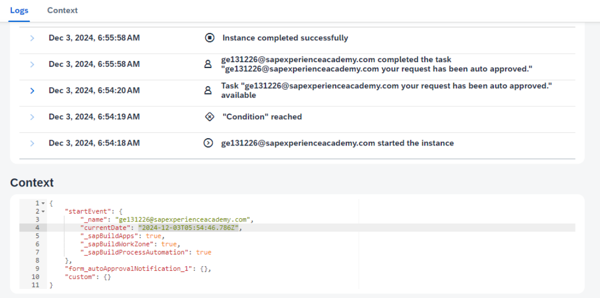

# ♠ 4 [CREATING THE END-TO-END SCENARIO](https://learning.sap.com/learning-journeys/experiencing-end-to-end-sap-build/exercise-creating-the-end-to-end-szenario)

> :exclamation: Objectifs
>
> - [ ] Create the SAP Build End-To-End scenario for certification registration.

## :closed_book: SAP BUILD USE CASE FOR CERTIFICATION REGISTRATION

### BUSINESS SCENARIO AND EXERCISE GOAL

Afin de démontrer la rapidité et la simplicité d'intégration des produits low-code de SAP Build, le scénario suivant est abordé. Dans ce scénario, un responsable souhaite obtenir une vue d'ensemble du processus d'apprentissage de ses employés sur les produits SAP Build avant leur admission à la certification. Pour ce faire, une application, un processus et un site métier seront créés et connectés sans aucun code.

[Link Video](https://learning.sap.com/learning-journeys/experiencing-end-to-end-sap-build/exercise-creating-the-end-to-end-szenario)

L'objectif de cet exercice est de créer un processus avec deux flux et de le publier dans la bibliothèque SAP Build pour que les applications SAP Build puissent le déclencher. Les variables clés incluent un nom (adresse e-mail via une variable système de l'utilisateur SAP BTP) et la date du jour (via une fonction de formule). Elles incluent également la sélection de trois produits SAP Build (SAP Build Apps, SAP Build Process Automation et SAP Build Work Zone). Si les trois produits sont sélectionnés, l'approbation automatique est déclenchée. Si aucun produit n'est sélectionné, la demande est transmise à un responsable pour approbation ou rejet, et enregistrée dans Ma boîte de réception.

Assurez-vous que les journaux et le contexte sont visibles dans la section de surveillance. Il doit être clair que le processus a été déclenché par ces cinq variables. Assurez-vous que la notification est envoyée dans Ma boîte de réception. Une fois terminé, prenez une capture d'écran de votre résultat (journaux et contexte) pour la partager lors de votre examen.

> Hint
>
> Concentrez-vous sur l'objectif final, et non sur les étapes, afin de permettre plusieurs solutions et une flexibilité dans la logique et l'interface utilisateur.

N'hésitez pas à déployer l'application et à l'intégrer à SAP Build Work Zone.

Bonne chance !

### PREREQUISITES

Pour commencer les exercices pratiques, suivez attentivement ces étapes afin de préparer un environnement SAP Build avec un utilisateur d'essai :

1. Ouvrez la page d'inscription à l'essai SAP Build Basic.

2. Inscrivez-vous pour un utilisateur d'essai SAP Build Basic :

   - Si vous êtes déjà connecté à SAP.com avec votre identifiant/profil universel SAP, votre utilisateur d'essai sera généré directement.

   - Si vous n'êtes pas connecté, veuillez remplir le formulaire pour générer votre utilisateur d'essai.

3. Retournez au parcours d'apprentissage :

   - Une fois inscrit, vous avez reçu votre identifiant et votre mot de passe d'essai Basic.

   - Un bouton s'affiche à l'écran pour revenir directement au parcours d'apprentissage.

4. Accès au système de formation :

   - Ouvrez le système de formation

   - Connectez-vous au système de formation avec votre identifiant et votre mot de passe.

En suivant ces étapes, vous obtenez l'accès nécessaire pour effectuer efficacement les exercices pratiques.

> Note
>
> Lors de la création de processus dans le lobby SAP Build, indiquez toujours votre identifiant dans le nom du projet. Cela vous permettra d'identifier facilement vos processus ultérieurement. Exemple : (Nom du projet) Enregistrement de certification (ID utilisateur) GE134601.

### ADDITIONAL GUIDANCE FOR BUILDING A COMPLETE SCENARIO

1.  Créez le processus d'inscription à la certification dans SAP Build Process Automation.
    Un employé ayant suivi les formations SAP Build Apps, SAP Build Process Automation et SAP Build Work Zone doit l'initier.

         | **Name**                     | **Type** |
         |------------------------------|----------|
         | User                         | String   |
         | Date                         | String   |
         | SAP Build Process Automation | Boolean  |
         | SAP Build Apps               | Boolean  |
         | SAP Build Work Zone          | Boolean  |

    Process Flow:

    a. Vérification de l'état : Si l'employé confirme les trois produits, le processus passe à l'approbation automatique pour l'inscription à la certification. Une notification est alors envoyée à l'apprenant.

    b. Si un ou plusieurs produits ne sont pas terminés, le processus est transmis à l'approbation de la direction pour examen. Le responsable peut alors décider d'approuver ou de rejeter la demande en fonction de son statut d'achèvement. Des notifications sont envoyées à l'apprenant pour approbation ou rejet.

    Une fois le processus terminé, il doit être déployé et publié dans la bibliothèque SAP Build Lobby, ce qui le rend accessible aux applications SAP Build.

    > Note
    >
    > Les notifications peuvent être consultées dans la boîte de réception SAP Build Lobby.

2.  Créez une application avec SAP Build Apps pour déclencher le processus.

    a. Créez un projet dans SAP Build Apps et attribuez-lui le titre d'utilisateur.

    b. Incluez le processus précédemment créé et activez-le.

    c. Utilisez des composants pour concevoir l'interface utilisateur, permettant ainsi la sélection des produits low-code SAP Build Apps, SAP Build Process Automation et SAP Build Work Zone.

    > Note
    >
    > Vous pouvez télécharger et implémenter une image selon vos besoins.

    d. À l'aide d'un bouton et de la logique correspondante, déclenchez le processus précédemment créé et transmettez les variables des produits SAP Build Process Automation, SAP Build Apps et SAP Build Work Zone avec des valeurs true ou false.

    e. Deux autres variables doivent également être transmises :

    | **Variable** | **Explanation**                                                                |
    | ------------ | ------------------------------------------------------------------------------ |
    | Name         | The user’s email from the subaccount using a function from the Formula Editor. |
    | Date         | A basic date function without specifics from the Formula Editor.               |

    > Hint
    >
    > Ces fonctions et d’autres détails peuvent être trouvés dans la deuxième leçon de l’unité 1 et dans le [parcours d’apprentissage SAP Build Apps](https://learning.sap.com/learning-journeys/develop-apps-with-sap-build-apps-using-drag-and-drop-simplicity/using-formula-functions-_b565fa9d-c2c4-4061-b40d-07febf1436b3) (Utilisation des fonctions de formule).

    f. Ajoutez une logique pour une boîte de dialogue demandant à l'apprenant s'il se sent prêt pour l'examen de certification. Le processus sera déclenché en cas de confirmation. En cas de refus, redirigez l'apprenant vers https://learning.sap.com/.

    > Note
    >
    > Ce composant logique d'URL de redirection est disponible dans la leçon du parcours d'apprentissage de la marketplace.

    g. Testez l'application en sélectionnant d'abord deux produits SAP Build comme valides et en déclenchant le processus. Sélectionnez ensuite les trois et relancez le processus. Consultez la boîte de réception et les notifications dans le lobby SAP Build pour vérifier le bon fonctionnement du processus et de l'application.

    > Note
    >
    > Assumez à la fois le rôle de l'apprenant et du responsable pour approuver ou rejeter le processus.

    h. Recherchez votre processus déclenché dans l'onglet Surveillance « Instances de processus et de workflow » et prenez une capture d'écran de votre résultat à partager lors de votre examen.

    i. Enfin, créez et déployez l'application en tant qu'application web sur Cloud Foundry afin qu'elle s'exécute sur SAP BTP.

3.  Étapes de déploiement dans le système d'exercice (facultatif)

    a. Après avoir choisi « Déployer », sélectionnez un environnement dans la liste déroulante, par exemple https://api.cf.eu10-004.hana.ondemand.com.

    b. Choisissez « Connexion avec BTP ».

    c. Vous serez invité à vous connecter à l'environnement de déploiement (Cloud Foundry). Saisissez « academy-platform » et cliquez sur le bouton « Se connecter avec un autre fournisseur d'identité ».

    d. Choisissez « Autoriser ».

    e. Une fois connecté, sélectionnez les détails de déploiement Cloud Foundry pertinents, par exemple, comme illustré ci-dessous, puis choisissez « Continuer ».

    - Organisation : sap-build-eu10-trial-2

    - Espace : AC_SAPBUILD

    Pour un guide plus détaillé, consultez le manuel du scénario de commande client étendu ou, en cas de divergences dans les spécifications système :

    - [Configurez les paramètres de votre build](https://trials.cfapps.eu10-004.hana.ondemand.com/learning-journey/SAP-Build-Experience/324-1_BuildApps-Deploy).

    - [Déployez et exécutez l'application](https://trials.cfapps.eu10-004.hana.ondemand.com/learning-journey/SAP-Build-Experience/324-2_BuildApps-Deploy).

4.  Créez un espace de travail avec SAP Build Work Zone et implémentez l'application créée (facultatif).

    a. Créez un projet SAP Build Work Zone et ajoutez le nom d'utilisateur que vous avez généré au titre.

    b. Créez un espace de travail.

    c. Intégrez l'application sous forme de carte.

    d. Le processus peut désormais être déclenché depuis l'espace de travail.

    e. Reportez-vous aux étapes de bout en bout.

    En suivant ces tâches, vous comprendrez comment intégrer les produits SAP Build pour créer des applications et des processus efficaces et fonctionnels sans écrire de code.
