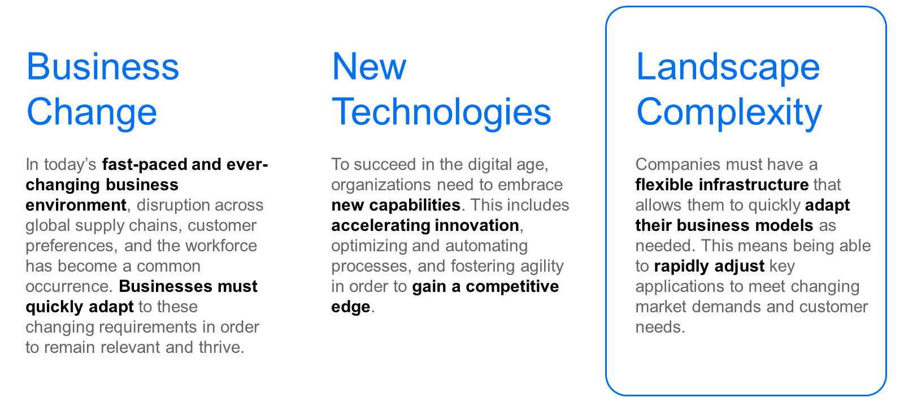

# ♠ 1 [EXAMINING SYSTEM LANDSCAPES](https://learning.sap.com/learning-journeys/managing-clean-core-for-sap-s-4hana-cloud/examining-system-landscapes-1)

> :exclamation: Objectifs
>
> - [ ] Describe the importance of being able to quickly adapt system landscapes

## :closed_book: ADAPTING SYSTEM LANDSCAPES

### ERP CHALLENGES TODAY: WHY DO WE NEED CLEAN CORE?

Dans les deux premières leçons de l'unité, nous avons étudié l'adaptation des entreprises et l'innovation technologique : deux moteurs de changement que SAP S/4HANA Cloud et les principes de base propres peuvent contribuer à atténuer. Dans la dernière leçon, nous terminons notre exploration des défis clients en examinant la complexité du paysage. Dans un environnement économique en constante évolution, les entreprises doivent disposer d'une infrastructure simple et flexible leur permettant d'adapter rapidement leurs modèles économiques. Par exemple, une entreprise peut avoir besoin d'adapter rapidement certaines applications clés pour répondre à l'évolution des demandes du marché et des besoins des clients.

> 
>
> Landscape challenges :
>
> - Adaptations du modèle économique.
>
> - Adaptations clés des applications.
>
> - Évolution des préférences des clients.

### ADAPTING BUSINESS MODELS

L'une des principales raisons pour lesquelles les entreprises doivent privilégier la simplicité et la flexibilité de leur infrastructure est la nécessité de répondre rapidement à l'évolution des exigences du marché. Comme mentionné dans la première leçon consacrée aux changements opérationnels, les perturbations des chaînes d'approvisionnement mondiales, l'évolution des préférences des clients et la conformité réglementaire constituent des défis majeurs pour les entreprises d'aujourd'hui. Cependant, ces défis ne sont pas les seuls auxquels une entreprise peut devoir s'adapter. De nos jours, de nouveaux marchés peuvent apparaître soudainement et sans prévenir, offrant d'incroyables opportunités de profit. Bien souvent, le premier entrant sur ces marchés en récolte la majeure partie. Pour rester compétitives et saisir les opportunités, les entreprises doivent être capables de faire évoluer rapidement leurs modèles économiques, et leur environnement technologique ne doit pas constituer un obstacle à cette évolution.

### RAPID ADJUSTMENT OF KEY APPLICATIONS

Outre l'adaptation de leurs modèles économiques, les entreprises doivent également être capables d'adapter rapidement leurs applications clés à l'évolution des demandes du marché. Qu'il s'agisse d'augmenter ou de réduire la capacité de leurs applications, d'intégrer de nouvelles technologies ou d'améliorer l'expérience utilisateur, la flexibilité nécessaire pour modifier rapidement leurs applications clés est cruciale. Par exemple, un commerce de détail peut avoir besoin d'adapter rapidement sa plateforme de commerce électronique pour gérer l'augmentation du trafic pendant les périodes de forte affluence. De même, une société de services financiers peut avoir besoin de mettre à jour son application bancaire mobile afin d'offrir de nouvelles fonctionnalités et de répondre aux demandes de ses clients.

### RESPONDING TO CHANGING CUSTOMER NEEDS

Répondre à l'évolution des besoins et des préférences des clients est un autre domaine où une infrastructure technologique flexible est essentielle. Avec l'essor des réseaux sociaux, des avis en ligne et de l'accès instantané à l'information, les clients sont devenus plus compétents et plus exigeants. Les entreprises doivent être capables de répondre rapidement à leurs commentaires et d'adapter leurs produits et services en conséquence. Cette réponse peut impliquer de modifier les interfaces utilisateur, d'ajouter de nouvelles fonctionnalités ou d'intégrer des mécanismes de retour client directement dans leurs applications.

### CLOUD COMPUTING AND AGILE DEVELOPMENT

Le cloud computing est un outil essentiel pour une infrastructure technologique simple et flexible. Il permet aux entreprises d'adapter rapidement leurs ressources à la demande et d'accéder aux dernières technologies sans nécessiter d'investissements initiaux importants. Ceci est particulièrement important pour les startups et les petites entreprises qui ne disposent pas toujours des ressources financières nécessaires pour investir dans une infrastructure sur site complète et élaborée.

Les méthodologies de développement agiles jouent également un rôle essentiel pour permettre aux entreprises d'adapter leur infrastructure technologique à l'évolution de leurs besoins. En décomposant les grands projets en segments plus petits et plus faciles à gérer, les entreprises peuvent rapidement itérer et répondre aux retours, réduisant ainsi les délais de commercialisation des nouvelles applications et fonctionnalités. Cette agilité permet aux entreprises de garder une longueur d'avance sur la concurrence et de proposer des produits et services répondant aux exigences des clients et du marché. Étroitement lié aux méthodologies de développement agiles, DevOps optimise le cycle de vie du développement logiciel et des opérations grâce à des processus et des outils.

### SAP S/4HANA CLOUD, SAP BTP AND LANDSCAPE FLEXIBILITY

À l'instar des évolutions métier et des innovations technologiques, SAP S/4HANA Cloud relève efficacement le défi de la flexibilité du paysage. À première vue, les options de flexibilité offertes par une solution cloud peuvent sembler limitées. Cependant, SAP S/4HANA Cloud est extensible et propose des API prêtes à l'emploi, accompagnées d'outils et de documentation, permettant aux clients de s'intégrer facilement à leurs partenaires ou de s'appuyer sur ces dernières. De plus, l'innovation continue offerte par SAP S/4HANA Cloud ne compromet pas cette flexibilité. Les clients bénéficient du meilleur des deux mondes. Avec SAP S/4HANA Cloud, SAP BTP propose une plateforme cloud native moderne en tant que service qui regroupe intelligence artificielle, machine learning, données, analytique, bases de données, DevOps et bien plus encore, au sein d'une architecture holistique et d'un environnement unifié.

### CONCLUSION

En conclusion, une infrastructure technologique simple et flexible est essentielle. Elle permet aux entreprises d'adapter leurs modèles économiques, d'ajuster leurs applications clés et de répondre à l'évolution des demandes et des besoins du marché et des clients. Grâce au cloud computing, au développement agile et à une approche centrée sur le client, les entreprises peuvent acquérir la flexibilité nécessaire pour prospérer dans le contexte économique mondialisé et en constante évolution d'aujourd'hui. En investissant dans une infrastructure technologique flexible, les entreprises peuvent se positionner pour assurer leur réussite et leur croissance à long terme.

> 
>
> SAP S/4HANA Cloud, grâce à ses capacités d'extensibilité et d'intégration, offre aux clients une solution pour relever les défis du paysage.
