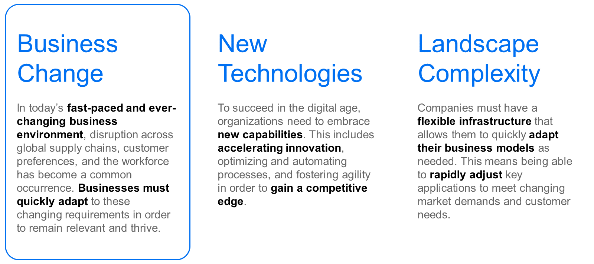

# ♠ 1 [EXAMINING BUSINESS MODELS](https://learning.sap.com/learning-journeys/managing-clean-core-for-sap-s-4hana-cloud/examining-business-models-1)

> :exclamation: Objectifs
>
> - [ ] Describe the importance of being able to quickly adjust business models

## :closed_book: ADJUSTING BUSINESS MODELS

### ERP CHALLENGES TODAY: WHY DO WE NEED CLEAN CORE?

Les logiciels ERP sont essentiels à la gestion et à la mise en œuvre des processus métier d'une entreprise. Présents depuis des décennies, les logiciels ERP de SAP permettent aux entreprises d'atteindre tous les objectifs qu'elles souhaitent atteindre grâce à un système ERP. SAP proposait traditionnellement SAP ERP, une version du logiciel ERP que les clients installaient dans leurs propres centres de données. Cependant, avec l'émergence et la prolifération des technologies cloud, les entreprises avaient besoin d'une solution ERP cloud. SAP S/4HANA Cloud est la solution idéale. Conçue comme une solution cloud native, SAP S/4HANA Cloud offre le meilleur des deux mondes : un système ERP intégrant les dernières meilleures pratiques du secteur et bénéficiant d'une innovation continue. En bref, un ERP cloud prêt à l'emploi.

> 
>
> Le logiciel ERP de SAP, y compris le SAP ERP traditionnel et le nouveau SAP S/4HANA Cloud basé sur le cloud, a permis aux entreprises de gérer et de mettre en œuvre efficacement leurs processus métier.

Comme mentionné précédemment, le système ERP de SAP était traditionnellement installé et maintenu dans le centre de données de l'entreprise. Cependant, un système ERP basé sur le cloud tel que SAP S/4HANA Cloud est mis à jour en permanence. Ce système requiert une approche légèrement différente pour les clients, notamment pour la gestion des extensions ou des intégrations, par rapport à un environnement sur site. Pour faciliter cette approche, SAP a développé le concept de « noyau propre » que les clients peuvent suivre. Ce faisant, l'efficacité de SAP S/4HANA Cloud peut être maximisée.

Avant d'examiner les spécificités de chaque aspect du noyau propre pour SAP S/4HANA Cloud, examinons les défis qui rendent ce noyau propre indispensable pour les clients. Une bonne façon de conceptualiser ces défis est de les centrer autour de trois domaines. Le premier est l'adaptabilité de l'entreprise, que nous abordons dans cette leçon. Les changements technologiques et les défis du paysage constituent respectivement les deux leçons suivantes.

Dans le contexte économique dynamique et imprévisible d'aujourd'hui, les entreprises sont confrontées à un flot constant de perturbations. Elles doivent s'adapter rapidement à ces perturbations pour rester pertinentes et prospérer. Quelques-unes de ces perturbations peuvent être résumées comme suit :

- Perturbation des chaînes d’approvisionnement.

- Évolution des préférences des clients.

- Conformité réglementaire.

### THE IMPACT OF DISRUPTIONS IN GLOBAL SUPPLY CHAINS

Les chaînes d'approvisionnement mondiales sont l'épine dorsale de nombreux secteurs, voire de la plupart, et permettent aux entreprises de s'approvisionner en matériaux, de fabriquer des produits et de livrer des marchandises à leurs clients dans le monde entier. Cependant, les perturbations de ces chaînes d'approvisionnement peuvent avoir des conséquences considérables, impactant notamment les calendriers de production, les niveaux de stocks et la satisfaction client.

Les catastrophes naturelles, les tensions géopolitiques et les événements inattendus comme la pandémie de COVID-19 ont tous mis en évidence les vulnérabilités des chaînes d'approvisionnement mondiales. Ces événements soulignent l'importance d'intégrer la résilience et l'agilité dans les stratégies de gestion de la chaîne d'approvisionnement. Les entreprises qui dépendent d'une source unique d'approvisionnement pour les composants ou matériaux critiques sont vulnérables aux perturbations. Toute perturbation de la chaîne d'approvisionnement peut avoir un effet domino sur l'ensemble du processus de production.

Pour répondre efficacement aux perturbations des chaînes d'approvisionnement mondiales, les entreprises doivent diversifier leurs sources d'approvisionnement, nouer des relations solides avec leurs fournisseurs clés et mettre en œuvre des stratégies de gestion des risques robustes. Investir dans les technologies numériques, telles que les plateformes d'analyse avancée et de visibilité sur la chaîne d'approvisionnement, permet aux entreprises d'obtenir des informations en temps réel sur la performance de leur chaîne d'approvisionnement. Cet investissement permet d’identifier les risques potentiels avant qu’ils ne deviennent des perturbations majeures.

### CUSTOMER PREFERENCES: A MOVING TARGET

Outre les perturbations des chaînes d'approvisionnement mondiales, les entreprises sont également confrontées à l'évolution constante des préférences des clients. À mesure que les consommateurs deviennent plus informés et compétents, leurs attentes en matière de produits et de services évoluent. Il est donc essentiel pour les entreprises de rester agiles et réactives face à ces fluctuations de la demande.

L'essor du e-commerce, des réseaux sociaux et du marketing personnalisé a transformé la façon dont les entreprises interagissent avec leurs clients, créant de nouvelles opportunités et de nouveaux défis pour les entreprises de tous les secteurs. Les clients d'aujourd'hui attendent des expériences personnalisées, des interactions omnicanales fluides et des pratiques commerciales éthiques et durables, ce qui les oblige à adapter leurs stratégies et leurs offres pour répondre à ces demandes en constante évolution.

Pour anticiper l'évolution des préférences des clients, les entreprises doivent investir dans les études de marché, l'analyse client et les analyses de données afin de comprendre leur public cible et d'anticiper les évolutions de la demande. En misant sur l'innovation et l'expérimentation, les entreprises doivent constamment affiner leurs produits et services pour s'adapter à l'évolution des besoins et des préférences des clients, tout en favorisant une approche centrée sur le client dans toute l'organisation.

### REGULATORY COMPLIANCE: NAVIGATING THE EVER-CHANGING LANDSCAPE

Outre les perturbations de la chaîne d'approvisionnement et l'évolution des préférences des clients, l'évolution constante de la conformité réglementaire est un autre défi majeur auquel les entreprises sont confrontées dans le contexte actuel. Les réglementations gouvernementales et les normes sectorielles évoluent constamment, et les entreprises doivent s'y tenir informées pour rester en conformité et éviter des sanctions coûteuses.

Par exemple, dans le secteur de la santé, l'introduction de nouvelles lois sur la confidentialité ou la modification des réglementations de facturation peut avoir un impact significatif sur le fonctionnement des établissements de santé. Le non-respect de ces réglementations peut entraîner de lourdes amendes et nuire à la réputation de l'entreprise. Par conséquent, les entreprises doivent se tenir informées des changements réglementaires et adapter leurs processus et procédures en conséquence.

Pour répondre efficacement aux changements de conformité réglementaire, les entreprises peuvent mettre en place des systèmes et des processus de gestion de la conformité robustes. Cette réponse peut impliquer un suivi régulier des mises à jour réglementaires, des évaluations approfondies des risques et la mise en place de contrôles appropriés pour garantir une conformité continue. Les entreprises peuvent également investir dans des programmes de formation et d'éducation afin de s'assurer que les employés sont informés et équipés pour se conformer aux dernières exigences réglementaires.

> 
>
> La perturbation des chaînes d’approvisionnement, l’évolution des préférences des clients et la conformité réglementaire ne sont que quelques-uns des types de perturbations qui obligent les entreprises à s’adapter rapidement.

### CASE STUDY: HEDELBERG HOTEL CHAIN

Prenons un exemple concret de la nécessité d'adapter rapidement ses modèles économiques. Face à la pandémie de COVID-19, la chaîne hôtelière Heidelberg a dû relever ces trois défis. Les produits simples de la chaîne d'approvisionnement, tels que les serviettes et les masques, sont devenus difficiles à approvisionner, avec des délais de livraison longs. Les préférences des clients ont rapidement évolué, nombre d'entre eux préférant un processus d'enregistrement sans contact et la possibilité d'entrer et de sortir des chambres via leur téléphone plutôt qu'avec une carte magnétique. Les réglementations ont été publiées (et modifiées) rapidement en fonction des avancées scientifiques.

Pour relever ces défis, l'hôtel Heidelberg a décidé d'adopter SAP S/4HANA Cloud. Grâce à l'accent mis par SAP S/4HANA Cloud sur la rapidité de déploiement et la simplicité d'adoption, ainsi qu'à son approche moderne de création d'extensions, Heidelberg Hotels a pu s'adapter à la demande, au gré des évolutions de l'activité.

### CONCLUSION

En conclusion, les perturbations des chaînes d'approvisionnement mondiales, l'évolution des préférences des clients et la conformité réglementaire constituent des défis majeurs pour les entreprises d'aujourd'hui. Cependant, en adoptant SAP S/4HANA Cloud ERP, les organisations peuvent atténuer ces difficultés et en sortir plus fortes et plus résilientes.

> 
>
> SAP S/4HANA Cloud fournit une solution complète pour tous les défis liés au changement d'entreprise.
