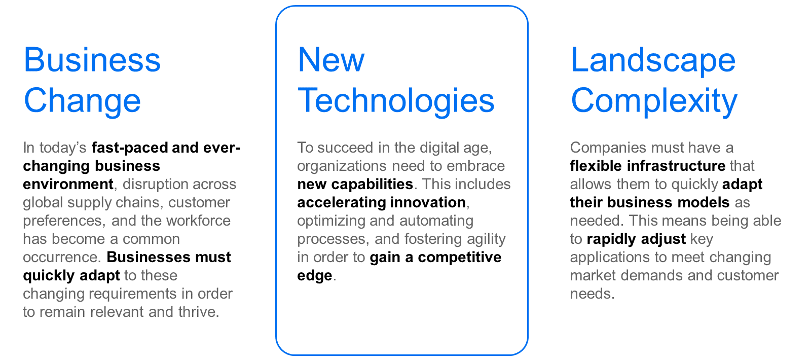

# ♠ 1 [EXAMINING TECHNOLOGY CHANGE](https://learning.sap.com/learning-journeys/managing-clean-core-for-sap-s-4hana-cloud/examining-technological-change-1)

> :exclamation: Objectifs
>
> - [ ] Describe the importance of being able to quickly embrace new technological capabilities

## :closed_book: EMBRACING NEW TECHNOLOGICAL CHALLENGES

### ERP CHALLENGES TODAY: WHY DO WE NEED CLEAN CORE?

Dans la leçon précédente, nous avons examiné la nécessité pour les organisations de s'adapter aux défis d'un monde des affaires en constante évolution. Dans cette leçon, nous nous intéressons aux défis technologiques.

Dans un monde actuel en constante évolution et de plus en plus numérique, il est essentiel pour les entreprises d'adopter les nouvelles avancées technologiques, d'accélérer l'innovation, d'optimiser et d'automatiser leurs processus métier et de favoriser l'agilité. Face à la croissance rapide des technologies et à l'évolution constante des exigences des consommateurs, les entreprises doivent s'adapter rapidement et efficacement aux changements technologiques pour conserver un avantage concurrentiel.

> 
>
> Le rythme des changements technologiques :
>
> - Nouvelles avancées technologiques
>
> - Accélération de l'innovation
>
> - Optimisation des processus métier
>
> - Favoriser l'agilité

### EMBRACING NEW TECHNOLOGICAL ADVANCEMENTS

Le rythme effréné des avancées technologiques a transformé notre façon de vivre, de travailler et de faire des affaires. De l'intelligence artificielle et de l'apprentissage automatique au cloud computing et à l'analyse du big data, les possibilités sont infinies. Les entreprises doivent donc être prêtes à adopter ces innovations et à les intégrer à leurs opérations pour rester pertinentes et compétitives.

L'un des principaux avantages des nouvelles avancées technologiques est le potentiel d'amélioration de l'efficacité et de la productivité. L'automatisation, par exemple, peut simplifier les tâches répétitives et chronophages et permettre aux employés de consacrer un temps et des ressources précieux à des tâches plus stratégiques et créatives. De plus, l'adoption de nouvelles technologies peut également améliorer l'expérience client globale, favorisant ainsi une plus grande satisfaction et une plus grande fidélité.

### ACCELERATING INNOVATION

L'innovation est le moteur de toute entreprise prospère. Elle est le moteur des nouveaux produits, services et processus qui distinguent les entreprises de leurs concurrents. Dans le marché concurrentiel actuel, accélérer l'innovation n'est plus une option : c'est une nécessité.

Les entreprises qui cultivent une culture de l'innovation et de la créativité sont mieux placées pour identifier de nouvelles opportunités et s'adapter aux évolutions du marché. Cette capacité peut conduire au développement de solutions innovantes qui non seulement répondent aux attentes des clients, mais les dépassent. Dans le monde actuel en constante évolution, la capacité à innover rapidement et efficacement peut faire la différence entre le succès et l'échec.

### OPTIMIZING AND AUTOMATING BUSINESS PROCESSES

L'optimisation et l'automatisation des processus métier sont essentielles pour rester compétitif sur le marché actuel. En rationalisant les opérations et en réduisant le travail manuel, les entreprises peuvent améliorer leur efficacité, réduire leurs coûts et minimiser le risque d'erreurs. De plus, comme mentionné précédemment, l'optimisation et l'automatisation permettent de libérer de précieuses ressources humaines pour se concentrer sur des tâches plus stratégiques et à plus forte valeur ajoutée.

Il est essentiel pour les entreprises d'évaluer leurs processus actuels et d'identifier les domaines dans lesquels l'optimisation et l'automatisation peuvent être mises en œuvre. Cette évaluation peut couvrir tous les aspects, du service client et des processus de vente à la gestion de la chaîne d'approvisionnement et aux opérations RH. En appliquant les dernières technologies et les meilleures pratiques, les entreprises peuvent se positionner pour une réussite et une croissance à long terme.

### FOSTERING AGILITY

Dans un monde en constante évolution et incertain, l'agilité est devenue un facteur de réussite essentiel pour les entreprises. La capacité à s'adapter rapidement, à s'adapter aux nouvelles circonstances et à saisir les opportunités émergentes est essentielle pour garder une longueur d'avance sur la concurrence. Les entreprises agiles peuvent réagir plus rapidement aux évolutions du marché, innover plus efficacement et nouer des relations plus solides avec leurs clients et partenaires.

Pour favoriser l'agilité, les entreprises doivent être prêtes à accepter le changement et l'incertitude. Cette approche peut impliquer de briser les silos traditionnels, de laisser les employés décider et de s'ouvrir aux nouvelles idées et perspectives. De plus, les entreprises doivent également être prêtes à investir dans les technologies et les outils adaptés à l'agilité, tels que les applications cloud et les plateformes collaboratives.

### SAP ERP, CLEAN CORE AND TECHNOLOGICAL INNOVATION

SAP S/4HANA Cloud offre aux clients une base solide pour exploiter et bénéficier des innovations technologiques. En tant qu'ERP cloud, SAP gère toutes les mises à jour, évitant ainsi aux clients de recourir à des ressources informatiques importantes et de subir des perturbations. La sécurité, la conformité et l'évolutivité sont intégrées à SAP S/4HANA Cloud. Les opérations importantes telles que la sauvegarde et la reprise après sinistre, la maintenance du système et la protection des données sont également gérées automatiquement, pour une tranquillité d'esprit optimale.

> 
>
> Les clients bénéficient des fonctionnalités intégrées de SAP S/4HANA Cloud telles que les mises à jour automatisées, la conception native du cloud et la conformité et l'évolutivité intégrées.

### CONCLUSION

En conclusion, la capacité des entreprises à adopter les nouvelles avancées technologiques, à accélérer l'innovation, à optimiser et automatiser leurs processus métier et à favoriser l'agilité est essentielle pour prospérer sur un marché concurrentiel. Ce faisant, elles peuvent se positionner pour assurer leur réussite, leur croissance et leur pérennité à long terme. Face à l'accélération du changement, il est crucial pour les entreprises de rester adaptables, avant-gardistes et disposées à adopter de nouvelles idées et technologies. Ce faisant, elles peuvent non seulement survivre, mais aussi prospérer sur un marché concurrentiel et en constante évolution. SAP S/4HANA Cloud, en tant que solution ERP cloud, est une excellente solution à déployer pour relever les défis technologiques.
