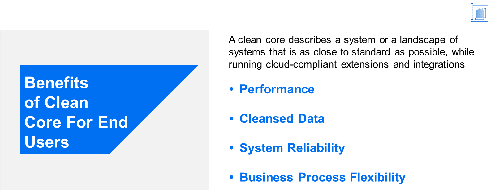

# ♠ 1 [ANALYSING THE BENEFITS OF CLEAN CORE FOR USERS](https://learning.sap.com/learning-journeys/managing-clean-core-for-sap-s-4hana-cloud/analyzing-the-benefits-of-clean-core-for-users-1)

> :exclamation: Objectifs
>
> - [ ] Describe the benefits of clean core for end users

## :closed_book: CLEAN CORE BENEFITS FOR END USERS

### OVERCIEW OF BENEFITS FOR USERS

Dans la deuxième unité, nous avons défini précisément ce qu'est un « noyau propre ». Nous avons vu qu'un « noyau propre » désigne un système aussi proche que possible des normes. Ce système exécute des extensions et des intégrations compatibles cloud, créées selon les directives et les bonnes pratiques standardisées de SAP. Nous avons également constaté que SAP S/4HANA Cloud répond efficacement aux défis auxquels une entreprise moderne est confrontée lorsqu'elle maintient un noyau propre dans toutes les dimensions pertinentes.

Dans cette unité, nous examinons les avantages d'un ERP « noyau propre » pour différentes parties prenantes. Dans cette première leçon, nous commençons par le plus important : les utilisateurs. Dans les deux unités suivantes, nous nous intéressons respectivement au personnel informatique et à l'entreprise dans son ensemble.

> 
>
> Un noyau propre permet aux utilisateurs de prendre de meilleures décisions plus rapidement avec une qualité et une disponibilité des données accrues.

### FRAGMENTED LEGACY SYSTEMS LEADING TO EXCESS TECHNICAL DEBT

La véritable valeur d'un logiciel d'entreprise réside dans les personnes qui l'utilisent au quotidien pour réaliser les tâches essentielles à la réalisation de la mission et de la raison d'être de l'entreprise. Ces tâches s'adressent à toutes les parties prenantes : employés, clients, investisseurs et la société en général. Prenons un exemple concret pour explorer les avantages d'un noyau propre pour les utilisateurs. C'est le cas de Gritty Pixel, une société de production confrontée à plusieurs défis qui freinent sa croissance et son avantage concurrentiel. Gritty Pixels est spécialisée dans la création de graphismes et de vidéos inspirants. Ses produits sont de qualité supérieure, précis et visuellement attrayants. Cependant, en coulisses, elle souffre de la complexité, de la lenteur et de la vulnérabilité de ses systèmes hérités. Ces derniers regorgent de fonctionnalités redondantes issues de personnalisations antérieures, sans parler des grandes quantités de données dupliquées.

Les défis posés par ces systèmes hérités sont les suivants :

- **Data silos and inefficient communication** : les différents services de l'entreprise fonctionnaient en vase clos, ce qui entraînait un manque de coordination et une mauvaise communication, entraînant retards, erreurs et doublons.

- **Manual and time-consuming processes** : L'entreprise s'appuyait fortement sur des processus manuels, tels que la saisie des données, la gestion des stocks et l'exécution des commandes. Ces processus étaient sujets aux erreurs, consommaient un temps précieux et entravaient l'évolutivité.

- **Lack of real-time insights** : Sans système centralisé, les décideurs n'avaient pas accès aux données en temps réel et devaient s'appuyer sur des rapports obsolètes. Cela entravait leur capacité à prendre rapidement des décisions éclairées et fondées sur des données.

### UNDERSTANDING THE CHALLENGES (USER PERSPECTIVE)

[Link Video](https://learning.sap.com/learning-journeys/managing-clean-core-for-sap-s-4hana-cloud/analyzing-the-benefits-of-clean-core-for-users-1)

### GREENFIELD IMPLEMENTATION OF S/4HANA CLOUD: A GAME-CHANGING SOLUTION

Consciente de la nécessité d'une solution complète pour relever ces défis, la société de production a découvert le concept de « noyau propre » avec SAP ERP. Intriguée par les avantages potentiels, elle a décidé de remplacer tous ses anciens systèmes complexes par une implémentation entièrement nouvelle d'un système cloud SAP S/4HANA. Comme une nouvelle implémentation démarre par défaut avec un noyau propre, Jane a constaté des avantages immédiats et évidents. Voyons comment ces avantages se sont concrétisés.

> 
>
> Un noyau propre permet aux utilisateurs de prendre de meilleures décisions plus rapidement avec une qualité et une disponibilité des données accrues.

Par défaut, un système SAP S/4HANA Cloud Public Edition démarre proprement.

### PERFORMANCE BENEFITS FOR USERS

L'un des avantages les plus évidents d'un cœur propre est l'amélioration des performances et de la réactivité du système. Un cœur propre élimine la complexité inutile grâce à des processus propres, réduit la surcharge du système grâce à des données propres et garantit une utilisation efficace des ressources. De plus, SAP S/4HANA Cloud étant basé sur SAP HANA, les applications bénéficient de performances accrues grâce aux données temps réel stockées en mémoire, plutôt que stockées dans la base de données. Jane bénéficie désormais de ces avantages. Les processus de vente, de production et d'inventaire sont désormais harmonisés dans SAP S/4HANA Cloud, sans interface avec d'autres systèmes. Ainsi, les anciennes tâches d'arrière-plan s'exécutent désormais comme des applications temps réel, avec une latence quasi nulle.

### DATA BENEFITS FOR USERS

Comme mentionné dans l'unité 2, l'une des dimensions d'un noyau propre est la propreté des données. Des données propres garantissent l'intégrité et l'exactitude des données, essentielles à une prise de décision éclairée. Grâce à un système de données bien structuré, Jane peut désormais être sûre que les données consultées dans ses rapports sont fiables et à jour. Ainsi, le risque que Jane prenne une décision sur la base d'informations erronées ou obsolètes est éliminé, ce qui améliore les résultats globaux de l'entreprise.

### SYSTEM STABILITY AND RELIABILITY BENEFITS FOR USERS

Des opérations propres constituent une autre dimension d'un noyau propre. Un système ERP doté d'un noyau propre est intrinsèquement plus stable et fiable. Cela s'explique notamment par le fait que la gestion des versions est établie comme base et intégrée aux opérations quotidiennes du système. Cette intégration se traduit par un système présentant peu d'incohérences, d'erreurs ou de bugs. Jane est informée à l'avance des innovations apportées aux applications qu'elle utilise au quotidien et ces innovations lui sont transmises de manière fluide et simple. Les rôles de sécurité du système lui sont attribués conformément aux meilleures pratiques SAP. Jane rencontre rarement (voire jamais) de problèmes dus à l'instabilité du système. En résumé, Jane constate une augmentation de sa productivité, une diminution de la frustration et, au final, une amélioration de ses performances.

### BUSINESS PROCESS BENEFITS FOR USERS

Avec un noyau propre, les processus métier sont clairs mais aussi flexibles. Ils peuvent s'adapter aux changements, qu'ils soient d'origine réglementaire, du marché ou autre. Un noyau propre constitue ainsi la base d'un système ERP flexible et évolutif. Dans le cadre du projet greenfield, Jane a collaboré avec les responsables et le service informatique pour garantir la clarté, la cohérence et la conformité des processus métier aux meilleures pratiques SAP.

À mesure que The Gritty Pixel se développe d'année en année, les processus métier et les workflows sont ajustés en conséquence. À mesure que l'entreprise pénètre de nouveaux marchés à travers le monde, différentes variantes locales des processus métier sont nécessaires et sont mises en œuvre en conséquence, avec Jane comme intervenante active.

### CONCLUSION

Un noyau propre est essentiel à la réussite d'une mise en œuvre ERP et offre de nombreux avantages aux utilisateurs. Il améliore les performances et la réactivité du système, renforce l'intégrité et la précision des données, garantit la stabilité et la fiabilité du système, simplifie l'expérience utilisateur et offre flexibilité et évolutivité. En privilégiant un noyau propre, les entreprises peuvent aider leurs employés à travailler plus efficacement, à prendre de meilleures décisions et à améliorer leur réussite globale. Comme l'a démontré Jane, un noyau propre n'est pas seulement un aspect technique, mais un facteur essentiel pour garantir la satisfaction et la productivité des utilisateurs.

> 
>
> SAP S/4HANA Cloud avec un noyau propre permet aux utilisateurs de collaborer de manière plus significative en utilisant une version unique de la vérité pour briser les départements cloisonnés.
