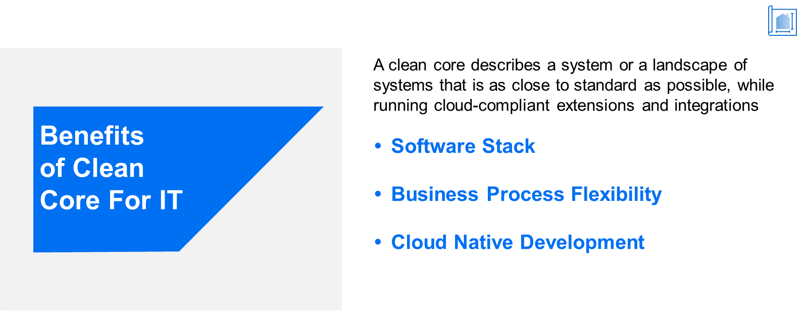

# ♠ 1 [ANALYSING THE BENEFITS OF CLEAN CORE FOR IT](https://learning.sap.com/learning-journeys/managing-clean-core-for-sap-s-4hana-cloud/analyzing-the-benefits-of-clean-core-for-it-1)

> :exclamation: Objectifs
>
> - [ ] Describe the benefits of clean core for the IT department

## :closed_book: CLEAN CORE BENEFITS FOR IT

### CLEAN CORE BENEFITS FOR IT

Après avoir exploré les avantages d'un cœur propre pour les utilisateurs d'une entreprise, intéressons-nous au service informatique. Comme pour les utilisateurs, nous utilisons l'exemple de The Gritty Pixel pour illustrer les avantages et les améliorations significatifs qu'un cœur propre avec SAP S/4HANA Cloud peut apporter.

Dans la plupart des cas, les défis rencontrés par les utilisateurs et abordés dans la leçon précédente s'appliquent également au service informatique. La perspective change, mais le défi reste le même. Pour résumer, les défis rencontrés par l'entreprise étaient les suivants :

Silos de données et communication inefficace : Les différents services de l'entreprise fonctionnaient en silos, ce qui entraînait un manque de coordination et une mauvaise communication. Cela entraînait des retards, des erreurs et des doublons.

Processus manuels et chronophages : L'entreprise s'appuyait fortement sur des processus manuels, tels que la saisie de données, la gestion des stocks et l'exécution des commandes. Ces processus étaient sujets aux erreurs, consommaient un temps précieux et entravaient l'évolutivité. Manque d'informations en temps réel : Sans système centralisé, les décideurs n'avaient pas accès aux données en temps réel et devaient s'appuyer sur des rapports obsolètes. Cet inconvénient entravait leur capacité à prendre rapidement des décisions éclairées et fondées sur les données.

### SETTINGS THE STAGE

Les responsabilités du service informatique sont bien plus vastes que celles des utilisateurs. Si l'interaction de ces derniers avec le système concerne l'exécution de leurs tâches quotidiennes, le service informatique est chargé de fournir les capacités technologiques nécessaires à la mise en œuvre de la stratégie de l'entreprise. En pratique, cette mise en œuvre peut s'avérer complexe. Pour The Gritty Pixel (comme pour de nombreuses autres organisations), les besoins spécifiques de l'entreprise nécessitaient de grandes quantités de code personnalisé. De plus, les données devaient être stockées dans des systèmes disparates, ce qui imposait au service informatique de développer et de maintenir un grand nombre d'interfaces. Comme nous l'avons mentionné précédemment, cela entraîne une dette technique importante.

Cette situation est déjà suffisamment difficile dans un monde où les changements sont lents. Face à l'évolution constante des préférences des clients, aux perturbations imprévisibles des chaînes d'approvisionnement et à l'innovation technologique constante, le service informatique a compris qu'une nouvelle approche était nécessaire.

> 
>
> La complexité de l’héritage empêche les organisations de tirer pleinement parti des avantages de la transformation.

[Link Video](https://learning.sap.com/learning-journeys/managing-clean-core-for-sap-s-4hana-cloud/analyzing-the-benefits-of-clean-core-for-it-1)

### UNDERSTANDING THE CHALLENGES (IT PERSPECTIVE)

Le catalyseur du changement est venu, paradoxalement, d'une bonne nouvelle. Le Gritty Pixel a fait l'objet d'un article de presse favorable, ce qui a accéléré la croissance des ventes. Face à cette demande accrue, la direction a décidé d'utiliser, en plus du modèle « Fabrication à la commande », jusqu'alors unique, un modèle supplémentaire, « Fabrication sur stock », pour la ligne de production. De plus, un modèle de financement serait mis en place pour les commandes afin de répondre aux besoins des petites entreprises nécessitant un modèle de paiement plus flexible. Le service informatique a été chargé de mettre en œuvre les modifications nécessaires au sein de l'infrastructure informatique. Klaus a alors indiqué à ses supérieurs que des difficultés surviendraient.

En raison de la documentation exhaustive (et inégale) des modifications, le cycle de test des nouveaux processus allait durer jusqu'à un an. De plus, deux des systèmes (ventes et production) devaient être mis à niveau l'année prochaine. Cette mise à niveau nécessite un flux de travail distinct pour tester la structure actuelle des processus métier, sans même tenir compte des deux nouveaux modèles envisagés. Enfin, Klaus était déjà confronté à un retard lié aux nombreuses demandes de modifications de l'interface utilisateur émanant des chefs de service et de division. Ces demandes allaient de l’ajout de champs supplémentaires sur les interfaces utilisateur à des scénarios de déploiement mobile complets.

### SAP S/4HANA CLOUD AS THE SOLUTION

Heureusement, la direction s'est montrée réceptive à la mise en œuvre d'une solution. Comme mentionné dans la leçon précédente, ils ont choisi SAP S/4HANA Cloud et SAP BTP comme solution complète pour relever les défis auxquels ils étaient confrontés. Un cœur de métier propre a été immédiatement mis en place grâce à une implémentation entièrement nouvelle, et Klaus a immédiatement commencé à en récolter les fruits. Le premier avantage a été l'élimination de toute la dette technique grâce au retrait de tous les systèmes existants.

> 
>
> SAP S/4HANA Cloud et Clean Core permettent de générer de la valeur commerciale sans contribuer à la dette technique.

### SOFTWARE STACK BENEFITS

Pour SAP S/4HANA Cloud et SAP Business Technology Platform, Klaus n'avait plus à se soucier de la pile logicielle principale. Celle-ci était toujours à la dernière version et Klaus n'avait jamais besoin d'implémenter lui-même de mises à niveau ou de packs de maintenance. SAP S/4HANA Cloud, solution cloud, recevait automatiquement les mises à jour et Karl recevait simplement une notification. Klaus disposait également d'un large éventail de solutions partenaires compatibles avec le noyau propre. Il pouvait toujours envisager ces solutions et, si nécessaire, créer des extensions parallèles sur SAP Business Technology Platform.

### BUSINESS PROCESS FLEXIBILITY BENEFITS

Toutes les parties prenantes, y compris la direction, ont convenu d'utiliser le contenu des meilleures pratiques SAP avec SAP S/4HANA Cloud. Ainsi, les processus de vente, de production, d'approvisionnement et de gestion des stocks de The Gritty Pixel étaient conformes aux normes de base dès le départ. Les réunions de revalidation des processus métier basées sur les mises à niveau, auparavant obligatoires, n'étaient plus nécessaires.

### CLOUD NATIVE DEVELOPMENT BENEFITS

Il y a quelques paragraphes, nous avons évoqué les extensions. Comme la plupart des organisations, The Gritty Pixel, tout en utilisant les meilleures pratiques SAP, devait néanmoins étendre ponctuellement les fonctionnalités de ses applications SAP. L'expérience de Klaus avec les systèmes existants était pour le moins inégale. Cependant, cette fois, Klaus s'appuyait sur un modèle de développement cloud natif de bout en bout (ABAP Cloud Development Model) et un modèle d'extensibilité de bout en bout (SAP S/4HANA Cloud Extensibility Model). Ainsi, Klaus pouvait créer des extensions tout en conservant un noyau propre. Les modifications appartenaient au passé. Les mises à niveau n'ont pas endommagé les extensions, et les extensions n'ont pas endommagé les mises à niveau.

### CONCLUSION

En adoptant des principes fondamentaux et en mettant en œuvre SAP S/4HANA, The Gritty Pixel a connu une transformation significative au sein de son service informatique. Ce système ERP a rationalisé les processus, aidé les employés et facilité la prise de décision basée sur les données. Le service informatique a gagné en efficacité, réduit les coûts et pérennisé sa technologie. Il a rempli sa mission principale : fournir l'infrastructure nécessaire à The Gritty Pixel pour accomplir sa mission. L'adoption de principes fondamentaux dans les systèmes ERP constitue un guide pour les organisations en quête de croissance durable et d'excellence opérationnelle.

> 
>
> Un cœur propre améliore la stratégie et l’exécution informatiques aujourd’hui et pose les bases de l’avenir.
