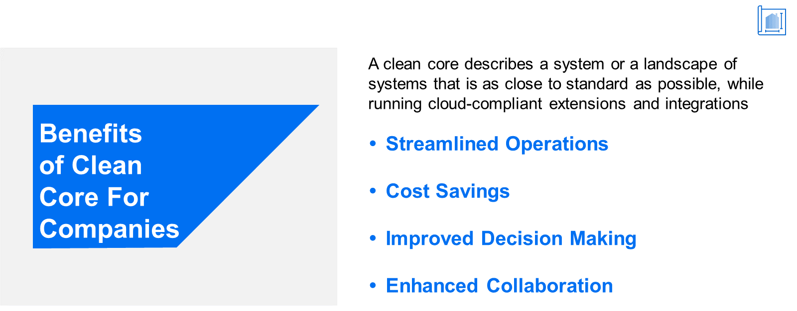

# ♠ 1 [ANALYSING THE BENEFITS OF CLEAN CORE FOR THE COMPANY](https://learning.sap.com/learning-journeys/managing-clean-core-for-sap-s-4hana-cloud/analyzing-the-benefits-of-clean-core-for-the-company-1)

> :exclamation: Objectifs
>
> - [ ] Describe the benefits of clean core for the company

## :closed_book: CLEAN CORE BENEFITS FOR A COMPANY

### CLEAN CORE BENEFITS FOR A COMPANY

Pour conclure notre exploration des avantages d'un cœur propre, nous nous intéressons à l'entreprise dans son ensemble. Dans le contexte économique actuel en constante évolution, une gestion efficace des opérations, des ressources et des données est essentielle à la réussite. Cette gestion est particulièrement pertinente pour les entreprises de production, où des processus rationalisés et une visibilité claire sur l'ensemble de la chaîne d'approvisionnement sont essentiels. Les systèmes de planification des ressources d'entreprise (ERP) offrent une solution complète à ces défis, aidant les entreprises à améliorer leur productivité, à réduire leurs coûts et à accroître la satisfaction client.

### SETTING THE STAGE

[Link Video](https://learning.sap.com/learning-journeys/managing-clean-core-for-sap-s-4hana-cloud/analyzing-the-benefits-of-clean-core-for-the-company-1)

> 
>
> SAP S/4HANA Cloud avec un noyau propre permet aux utilisateurs de collaborer de manière plus significative en utilisant une version unique de la vérité pour briser les départements cloisonnés.

### UNDERSTANDING THE CHALLENGES (COMPANY PERSPECTIVE)

Dans la leçon précédente, nous avons évoqué comment un article de presse favorable a entraîné une augmentation des commandes clients pour The Gritty Pixel. Et tout comme pour Klaus, l'augmentation rapide et soutenue du volume de commandes, bien que positive en soi, a mis en évidence les défis du système existant. Fatima souhaitait concevoir et implémenter une application permettant de créer une « boucle de rétroaction ». Des algorithmes d'apprentissage automatique analyseraient les tickets d'assistance client et prendraient les mesures appropriées en fonction des tendances détectées. Par exemple, si de nombreux clients demandaient de l'assistance pour une fonctionnalité produit, une note d'assistance pourrait être créée automatiquement pour le site web d'assistance. De plus, une nouvelle proposition d'atelier pourrait être créée, avec une structure de cours générée automatiquement, à partir du contenu des tickets analysés. Cet atelier pourrait ensuite être proposé aux clients.

Normalement, le service commercial soumet ce type de proposition au service informatique, qui prépare un plan tactique et un calendrier de mise en œuvre. Cependant, la réponse reçue par Fatima n'était pas celle qu'elle espérait. On lui a expliqué qu'aucun des systèmes actuels n'était conçu sur une plateforme intégrant des fonctionnalités d'apprentissage automatique. Même si tel était le cas, le nombre de systèmes et d’interfaces nécessaires à la mise en œuvre du scénario proposé serait trop coûteux.

### SELECTION AND IMPLEMENTATION OF AN ERP SYSTEM

Gritty Pixel a pris conscience des défis posés par ses systèmes existants et a constaté la nécessité d'une solution robuste. Gritty Pixel a donc entrepris une évaluation complète de différents systèmes ERP afin de trouver celui qui répondait à ses besoins spécifiques. Ce processus d'évaluation a pris en compte des facteurs tels que l'évolutivité, les options de personnalisation, la facilité d'intégration, la convivialité et la rentabilité.

Après mûre réflexion, l'entreprise a opté pour SAP S/4HANA Cloud. SAP S/4HANA Cloud était la seule solution offrant l'intégralité des modules nécessaires et adaptée à ses processus de production, notamment :

- gestion des stocks ;

- approvisionnement ;

- planification de la production ;

- ordonnancement ;

- ventes.

SAP Business Technology Platform offrait les plateformes nécessaires au développement personnalisé et aux extensions pour des scénarios tels que celui proposé par Fatima. Le processus de mise en œuvre a été mené en collaboration avec SAP, l'équipe informatique et les employés de différents services, et l'utilisation des meilleures pratiques SAP et de SAP Activate s'est déroulée de manière fluide et aisée.

### STREAMLINED OPERATIONS AND IMPROVED PRODUCTIVITY BENEFITS

Suite à la mise en œuvre de SAP S/4HANA Cloud, The Gritty Pixel a considérablement amélioré son efficacité opérationnelle. En intégrant tous les services et processus dans un système unique et centralisé, l'entreprise a éliminé les doublons et les retards liés à la saisie manuelle des données. Cela a permis de rationaliser les flux de travail, de réduire la paperasserie et d'accélérer les temps de réponse. Par exemple, le système a généré automatiquement des plans de production et optimisé l'allocation des ressources, ce qui a permis d'améliorer la productivité et de réduire les coûts de production.

### ENHANCED INVENTORY MANAGEMENT AND INVREASED COST SAVINGS BENEFITS

Avant de déployer SAP S/4HANA Cloud, l'entreprise peinait à assurer un suivi et une gestion précis de ses stocks. Cela entraînait souvent des écarts de stock, des ruptures de stock et des coûts de stockage excessifs. Grâce au système ERP, l'entreprise a obtenu une visibilité complète sur ses niveaux de stock en temps réel, garantissant ainsi un excellent niveau de stock et réduisant les risques de rupture. De plus, le suivi automatisé des stocks, associé à des capacités d'analyse de données, a permis à The Gritty Pixel d'identifier les tendances, de prévoir les fluctuations de la demande et de prendre des décisions d'achat éclairées. L'entreprise a ainsi considérablement réduit ses coûts de gestion des stocks et amélioré la satisfaction client grâce à de meilleurs taux d'exécution des commandes.

### IMPROVED DECISION-MAKING AND BUSINESS INTELLIGENCE BENEFITS

L'un des principaux atouts de SAP S/4HANA Cloud réside dans sa capacité à générer des rapports en temps réel et à fournir des analyses approfondies sur divers aspects de l'entreprise. En accédant à des informations précises et actualisées, la direction de l'entreprise a obtenu une vue d'ensemble de l'ensemble du processus de production, lui permettant de prendre rapidement des décisions éclairées. De plus, grâce à des tableaux de bord et des outils de reporting personnalisables, le système ERP a facilité la création de visualisations intuitives, l'analyse des tendances et les prévisions. Ces fonctionnalités ont permis à l'entreprise d'identifier les tendances du marché, d'optimiser les processus et d'aligner les stratégies de production sur les demandes des clients.

### ENHANCED COLLABORATION AND COMMUNICATION BENEFITS

Le système ERP s'est avéré essentiel à la collaboration interservices au sein de l'entreprise. Au lieu de s'appuyer sur des canaux de communication fragmentés ou des feuilles de calcul incohérentes, les employés ont pu accéder à une plateforme centralisée facilitant le partage d'informations. Cela a permis d'améliorer la communication, de réduire les erreurs de communication et d'optimiser la coordination tout au long du processus de production. De plus, le système ERP a permis une collaboration efficace entre l'entreprise XYZ et ses fournisseurs, favorisant ainsi de meilleures relations et une meilleure gestion de la chaîne d'approvisionnement.

> 
>
> Benefits of a clean core for companies:
>
> - Streamlined operations
>
> - Cost savings
>
> - Improved decision-making
>
> - Enhanced collaboration

### CONCLUSION

Le système ERP s'est avéré essentiel à la collaboration interservices au sein de l'entreprise. Au lieu de s'appuyer sur des canaux de communication fragmentés ou des feuilles de calcul incohérentes, les employés ont pu accéder à une plateforme centralisée facilitant le partage d'informations. Cela a permis d'améliorer la communication, de réduire les erreurs de communication et d'optimiser la coordination tout au long du processus de production. De plus, le système ERP a permis une collaboration efficace entre l'entreprise XYZ et ses fournisseurs, favorisant ainsi de meilleures relations et une meilleure gestion de la chaîne d'approvisionnement.

> 
>
> Comprendre la valeur potentielle qui peut être obtenue soutient l’investissement pour devenir et rester propre.
