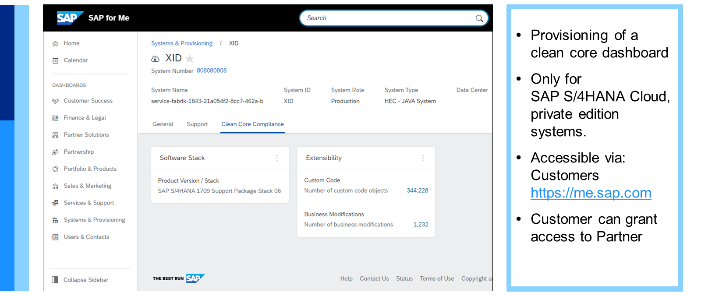

# ♠ 1 [EXPLORING HOW TO MAKE OPERATIONS CORE COMPLIANT](https://learning.sap.com/learning-journeys/managing-clean-core-for-sap-s-4hana-cloud/exploring-how-to-make-operations-core-compliant-1)

> :exclamation: Objectifs
>
> - [ ] Keep operations effective and efficient

## :closed_book: CLEAN OPERATIONS

### KEEP THE OPERATIONS EFFECTIVE AND EFFICIENT

Intéressons-nous maintenant à la dernière dimension d'un cœur de métier propre : les opérations. Dans un environnement commercial dynamique, des processus efficaces génèrent de la valeur, et mettre en avant le rôle de l'IT en tant que prestataire de services renforce l'agilité organisationnelle. Des opérations SAP S/4HANA Cloud propres sont essentielles pour y parvenir. Le mantra est : « Maintenir l'efficacité et l'efficience des opérations ».

### GUIDING PRINCIPLES

[Link Video](https://learning.sap.com/learning-journeys/managing-clean-core-for-sap-s-4hana-cloud/exploring-how-to-make-operations-core-compliant-1)

> 
>
> Mantra: "Keep the operations effective and efficient."

### CLEAN CORE MUST BE INTEGRATED IN THE END-TO-END VALUE PROCESS CHAIN FOR OPERATIONS

Le noyau propre doit être intégré à la chaîne de valeur opérationnelle de bout en bout.

Il est impératif que les principes du noyau propre abordés dans ce cours soient intégrés à toutes les activités de l'entreprise. Les cadres de gouvernance, les prises de décisions stratégiques et tactiques, et même les décisions quotidiennes, doivent toujours être conçus et appliqués en tenant compte du noyau propre. Chaque entreprise étant unique, il est conseillé de confier au service informatique la responsabilité de la vision globale et des processus de bout en bout pour maintenir le noyau propre. Cette approche facilite la prise de décision, les performances et une gestion d'entreprise efficace.

À cette fin, le service informatique doit mettre en place une surveillance et des alertes intégrées pour toutes les facettes du noyau propre, telles que les données et les extensions. Une vision intégrée favorise un contrôle et une gestion efficaces. Des procédures de gestion des événements et d'escalade doivent également être établies par le service informatique (avec la participation de toutes les parties prenantes) et ces procédures doivent être conformes à tous les modèles de gouvernance du noyau propre.

Deux outils sont particulièrement efficaces pour atteindre cet objectif : SAP Solution Manager et SAP Cloud Application Lifecycle Management (SAP Cloud ALM). Les clients peuvent utiliser ces deux solutions pour exploiter des solutions métier cloud et hybrides au sein d'environnements système. SAP Cloud ALM est une solution cloud native plus récente, entièrement basée sur la technologie cloud. Elle est automatiquement incluse dans tous les abonnements cloud, prête à l'emploi. Voici quelques fonctionnalités de SAP Cloud ALM qui favorisent un fonctionnement propre :

- Détecter les incidents ;

- Analyser la cause profonde des incidents ;

- Corriger le problème identifié ;

- Automatiser les activités récurrentes.

En utilisant SAP Cloud ALM, les clients peuvent assurer la continuité de leurs activités et préserver leurs investissements cloud.

### RELEASE MANAGEMENT IS AN ESTABLISHED FOUNDATION FOR CLEAN CORE

Rappelez-vous, comme indiqué dans l'unité 2, leçon 1, « Analyse des composants du noyau propre », que l'un des éléments essentiels d'un noyau propre est que le système dispose toujours de la dernière version. Pour les clients SAP S/4HANA Cloud Public Edition, ce n'est pas un problème. Toutes les mises à jour sont déployées simultanément pour tous les clients. En revanche, pour les clients utilisant SAP S/4HANA Cloud Private Edition et SAP S/4HANA (ce dernier terme étant utilisé pour les clients utilisant des approches sur site ou hébergées), les mises à jour automatiques ne sont pas nécessaires. Ces clients peuvent déployer des innovations produit selon leur calendrier. Néanmoins, ils doivent s'efforcer d'utiliser la dernière version et, s'ils ne comprennent pas clairement les raisons de cette incapacité, ils doivent établir un calendrier d'adoption des versions. SAP S/4HANA ne doit pas rester figé. Ce calendrier doit être clairement défini dans les cadres de gouvernance et toute exception à ce calendrier doit être réservée à des raisons exceptionnelles.

### REGULAR HOUSEKEEPING TASKS AND PROCEDURES ARE ESTABLISHED

Dans le cadre d'un processus de nettoyage complet, des tâches et procédures de maintenance de conception doivent être établies. Ces tâches et procédures varient d'une entreprise à l'autre. Voici une courte liste pour commencer :

- Conception de tâches d'arrière-plan pour une utilisation efficace de l'infrastructure.
  Assurez-vous que vos tâches d'arrière-plan contribuent à une utilisation efficace de l'infrastructure plutôt qu'à une charge système inutile. Un processus de conception rigoureux crée un système axé sur les performances, augmentant la productivité tout en limitant la pression sur les ressources.

- Éviter les interfaces de fichiers pour l'importation ou l'exportation de données.
  Pour des raisons de sécurité, de cohérence et de maintenabilité du système, les organisations doivent éviter d'utiliser des interfaces de fichiers lors de l'importation ou de l'exportation de données. L'adoption de méthodes de transfert de données plus sûres et plus fiables peut protéger l'intégrité et la confidentialité des données.

- Révision et adaptation régulières des autorisations des utilisateurs.
  Enfin, il est essentiel de revoir et d'adapter régulièrement les autorisations des utilisateurs. Les autorisations inutiles doivent être supprimées afin de garantir la sécurité du système et de limiter les risques d'utilisation abusive ou de failles de sécurité.

> 
>
> Goals to aspire to:
>
> - Day-to-day operations are planned and applied regularly.
>
> - Opt-in on lifecycle events such as periodic upgrades
>
> - Compliance with preapproved maintenance windows

Pour faciliter les opérations de nettoyage du cœur de métier, les clients peuvent utiliser le tableau de bord de nettoyage du cœur de métier. Disponible via SAP for Me, vous pouvez y accéder en sélectionnant « Systèmes et provisionnement » sur le côté gauche de l'interface utilisateur, puis en sélectionnant l'onglet « Systèmes ». L'onglet « Conformité du cœur de métier » affiche des informations sur certaines mesures du cœur de métier. Parmi ces mesures, l'utilisateur peut consulter la version de la pile logicielle, le nombre d'objets de code personnalisés, le nombre de modifications métier et les extensions de niveau 1 effectuées.

Plusieurs points sont à noter concernant le tableau de bord de nettoyage du cœur de métier :

- Ce tableau de bord est uniquement disponible pour les systèmes SAP S/4HANA Cloud Private Edition.

- Les clients peuvent accorder l'accès au tableau de bord à leurs partenaires.

- Les mesures sont collectées uniquement pour les systèmes productifs.

- Deux autorisations sont nécessaires pour accéder au tableau de bord : (1) : SC_CCCREAD + (2) : INSTDISP (lecture) ou INSTPROD (modification).

- Le principal canal de collecte des données du tableau de bord est Early Watch Alert (EWA), configuré par SAP.

### CONCLUSION

En résumé, pour garantir une conformité optimale au sein de vos opérations SAP S/4HANA, la planification, les revues régulières et l'utilisation stratégique des services informatiques sont primordiales. En suivant ces étapes, votre organisation est bien placée pour préserver l'intégrité du système, améliorer son efficacité et générer des résultats commerciaux porteurs de valeur.

> 
>
> Les équipes informatiques doivent considérer la « maintien de la propreté » non pas comme une tâche purement technique, mais comme un service informatique fourni aux entreprises, où elles peuvent apporter une valeur ajoutée concrète. Elles doivent s'efforcer de maîtriser la vision du cœur propre et de tous les processus qui l'entourent, de bout en bout.
