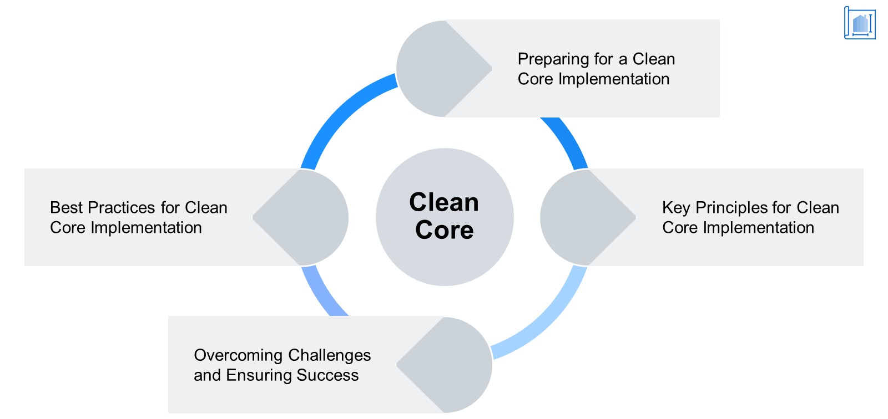

# ♠ 1 [EVALUATING CLEAN CORE BEST PRACTICES](https://learning.sap.com/learning-journeys/managing-clean-core-for-sap-s-4hana-cloud/evaluating-clean-core-best-practices-1)

> :exclamation: Objectifs
>
> - [ ] Describe the best practices from SAP on how to achieve a clean core

## :closed_book: CLEAN CORE BEST PRACTICES

### CLEAN CORE BEST PRACTICES

Dans l'unité 1, nous avons examiné les raisons d'utiliser un noyau propre. Nous avons identifié les défis spécifiques auxquels sont confrontées les organisations qui nécessitent un changement d'approche de leur architecture informatique, répondant à l'adoption d'un noyau propre. Dans l'unité 2, nous avons brièvement abordé les différentes dimensions du noyau propre. Nous avons examiné les différents impacts d'une approche du noyau propre d'une entreprise, selon qu'elle a adopté SAP S/4HANA Cloud en mode greenfield ou brownfield. Dans l'unité 3, nous avons exploré les avantages du noyau propre pour les différentes parties prenantes d'une organisation, telles que les utilisateurs, le personnel informatique et la direction générale.

Dans cette dernière unité, nous revenons sur les cinq dimensions du noyau propre présentées dans l'unité 1. Nous les examinons chacune en détail dans cette dernière leçon et abordons quelques bonnes pratiques recommandées par SAP. Ces pratiques s'appliquent à toutes les dimensions que les entreprises sont encouragées à adopter pour simplifier (et maintenir) un noyau propre. Il est important de noter que cette leçon ne mentionne pas toutes les bonnes pratiques possibles, mais plutôt certaines des plus importantes que les entreprises doivent prendre en compte.

### GENERAL FRAMEWORK FOR THINKING ABOUT CLEAN CORE PROJECTS

[Link Video](https://learning.sap.com/learning-journeys/managing-clean-core-for-sap-s-4hana-cloud/evaluating-clean-core-best-practices-1)

> 
>
> Achieving and keeping a clean core is a marathon, not a sprint. Make sure to have a well thought out strategy.

### PREPARING FOR A CLEAN CORE IMPLEMENTATION

La première étape pour résoudre un problème consiste à en admettre l'existence. Il en va de même pour le « clean core ». Dans l'unité précédente, nous avons vu que les difficultés liées à la croissance soudaine de The Gritty Pixel ont conduit à la décision de lancer un projet de transformation. Une fois cette décision prise, le chemin a commencé. Pour préparer la mise en œuvre d'un « clean core », les points spécifiques à considérer se répartissent en deux domaines :

- Réaliser une évaluation complète des processus métier ;

- Établir un cadre de gouvernance solide.

### CONDUCTING A COMPREHENSIVE ASSESSMENT OF BUSINESS PROCESSES

Cette tâche pourrait impliquer de nombreuses personnes impliquées dans la conception et l'exécution des processus métier. Des utilisateurs qui appliquent les différentes étapes d'un processus aux cadres intermédiaires qui supervisent plusieurs équipes, en passant par les cadres supérieurs impliqués dans l'analyse et l'analyse des tendances. Une implémentation greenfield, comme nous l'avons évoqué dans l'unité 2, est une excellente occasion de se poser la question non seulement « Comment améliorer quelque chose ? », mais aussi « devons-nous vraiment le faire ? ». SAP S/4HANA Cloud, associé à SAP Business Technology Platform, offre la possibilité de repenser les processus de manière simplifiée en utilisant à la fois des tâches centrées sur l'humain et des tâches automatisées, dans la proportion appropriée, compte tenu de l'entreprise, du secteur et du processus concerné. L'heure n'est pas à la timidité. Une entreprise peut être audacieuse et innovante. Pour mener à bien cette évaluation, les entreprises peuvent utiliser le modèle de cadre suivant :

- Évaluer les processus métier, les systèmes et les structures de données existants ;

- Identifier les axes d'amélioration et les défis potentiels ;

- Impliquer les parties prenantes pour bien comprendre les besoins métier.

### ESTABLISHING A STRONG GOVERNANCE FRAMEWORK

Un cadre de gouvernance solide est essentiel à la réussite d'un projet de transformation. Et cette force commence au sommet. La direction d'une organisation doit s'engager dans le projet, non seulement en paroles, mais aussi en termes de financement. Il peut parfois être difficile d'établir un noyau propre. Avec une approche greenfield, la transformation technique et la transformation métier se déroulent simultanément. En revanche, avec une approche brownfield, la transformation technique a tendance à intervenir en premier. Un projet brownfield étant centré sur la conversion d'un système, l'analyse et le nettoyage du code personnalisé peuvent s'avérer longs, surtout si la dette technique accumulée au fil des ans avec les systèmes existants est considérable. Il est donc impératif que l'équipe informatique, principalement responsable de l'analyse et de la transformation du système, sache qu'elle bénéficie du soutien total de la direction. Un bon modèle pour commencer à établir ce cadre repose sur les éléments suivants :

- Développer une structure de gouvernance avec des rôles et des responsabilités définis ;

- S'assurer de l'engagement et de l'appropriation de la direction ;

- Aligner la stratégie informatique sur les objectifs stratégiques globaux de l'organisation.

### KEY PRINCIPLES FOR CLEAN CORE IMPLEMENTATION

Cet axe s'inscrit dans la continuité de l'étape « Réalisation d'une évaluation complète des processus métier » mentionnée il y a quelques minutes dans la section « Préparation à une mise en œuvre propre du noyau ». En général, les équipes projet doivent mettre l'accent sur les points suivants :

- Identifier et éliminer les étapes de processus inutiles ;

- Réduire les écarts et les exceptions ;

- Appliquer les meilleures pratiques et la normalisation du secteur.

### RATIONALIZING DATA STRUCTURES

Comme l'a dit le mathématicien Clive Humby, « les données sont le nouveau pétrole ». Le nettoyage de ces données fait partie intégrante de tout projet de nettoyage de base. Les clients doivent garder à l'esprit les points suivants :

- Évaluer la qualité des données et mener des activités de nettoyage des données ;

- Réduire les données dupliquées ou redondantes ;

- Mettre en œuvre un cadre de gouvernance des données.

### SIMPLIFYING IN BOTH BROWNFIELD AND GREENFIELD SCENARIOS

Comme mentionné précédemment, les projets greenfield sont axés sur de nouvelles implémentations, tandis que les projets brownfield sont axés sur la conversion de systèmes. Les clients pensent parfois que la simplification et l'innovation ne sont possibles qu'avec la première. Or, ce n'est pas le cas. La conversion n'est pas incompatible avec l'innovation. Qu'elles conservent le meilleur de l'ancien ou repartent de zéro, les entreprises doivent néanmoins se rappeler de :

- Réduire au minimum les personnalisations des fonctionnalités standard ;

- Réduire au minimum les extensions. Si nécessaire, s'assurer qu'elles sont réalisées conformément au modèle d'extensibilité de SAP S/4HANA Cloud ;

- Évaluer et supprimer les applications obsolètes ou sous-utilisées ;

- Adopter des technologies innovantes telles que l'intelligence artificielle et l'automatisation robotisée des processus.

### SOME BEST PRACTICES FOR CLEAN CORE IMPLEMENTATION

Examinons quelques bonnes pratiques supplémentaires que les équipes projet doivent garder à l'esprit dans leurs efforts de nettoyage :

- S'aligner sur l'architecture de référence de SAP ;

- Adopter la méthodologie Activate de SAP ;

- Appliquer les outils et technologies SAP.

### ALIGNING WITH SAP'S REFERENCE ARCHITECTURE

Tout projet de transformation implique des décisions finales concernant l'environnement système. Il est rare qu'une intégration soit nécessaire dans ce type de projet. Les entreprises doivent garder à l'esprit les points suivants pour préserver l'environnement :

- Adhérer à l'environnement système et aux architectures modulaires recommandés par SAP ;

- Utiliser les bonnes pratiques sectorielles de SAP pour la standardisation ;

- Optimiser le potentiel d'intégration grâce à SAP Integration Suite.

### ADOPTING SAP'S ACTIVATE METHODOLOGY

SAP Activate offre aux clients une source unique regroupant les meilleures pratiques, une méthodologie de mise en œuvre éprouvée et des outils de configuration guidée pour déployer SAP S/4HANA Cloud. Dans le cadre de l'utilisation du framework SAP Activate, les clients doivent veiller à :

- Adopter des pratiques de mise en œuvre agiles pour des déploiements plus rapides et efficaces ;

- Impliquer les parties prenantes grâce à des ateliers collaboratifs et au prototypage ;

- Exploiter les accélérateurs de solutions sectorielles préconfigurés de SAP.

### APPLYING SAP'S TOOLS AND TECHNOLOGIES

Nous avons longuement évoqué les différents outils disponibles pour nos clients, à différentes étapes et dans différents domaines, afin de garantir et de maintenir un noyau propre. Pour terminer, voici deux autres outils que les équipes projet peuvent retenir :

SAP Data Migration Cockpit pour une migration efficace des données.

SAP Fiori Custom Code Migration App pour analyser le code personnalisé à migrer.

### OVERCOMING CHALLENGES AND ENSURING SUCCESS

Tous les projets, quelle que soit leur réussite finale, peuvent rencontrer quelques difficultés en cours de route. Des aspects tels que les données, les intégrations et les extensions font l'objet d'une attention particulière dès le début de la conception et tout au long de la mise en œuvre. Ce sont généralement les petits détails qui sont négligés. Les équipes projet doivent veiller aux points suivants :

### CHANGE MANAGEMENT AND USER ADOPTION

Un projet doit disposer dès que possible d'un plan complet de gestion du changement organisationnel. Les utilisateurs eux-mêmes doivent être partie prenante de l'élaboration de ce plan. Il ne doit pas être uniquement hiérarchique. Il est également important de ne pas oublier de prioriser la formation et l'accompagnement des utilisateurs finaux pour favoriser l'adoption, objectif ultime de tout projet de transformation.

### CONTINUOUS IMPROVEMENT AND INNOVATION

Les retours d'expérience de toutes les parties prenantes doivent être encouragés. Ils doivent constituer le pilier de l'amélioration continue et de l'innovation des processus métier. De même, le service informatique doit les exploiter pour évaluer régulièrement les performances des systèmes et affiner les configurations. Enfin, les clients doivent se tenir informés des dernières offres et feuilles de route produits de SAP, ce qui constitue un catalyseur supplémentaire d'innovation.

### CONCLUSION

Un cœur propre est la clé d'une mise en œuvre ERP réussie, et les bonnes pratiques SAP offrent des conseils précieux aux organisations qui se lancent dans cette transformation. En privilégiant la rationalisation des processus métier, la rationalisation des données et la simplification des environnements système, les entreprises peuvent atteindre l'excellence opérationnelle et exploiter pleinement le potentiel des puissantes solutions d'entreprise SAP. Grâce à une compréhension approfondie des principes d'un cœur propre, les organisations ouvrent la voie à un système ERP pérenne, moteur de croissance, d'efficacité et de compétitivité dans un environnement commercial en constante évolution.
